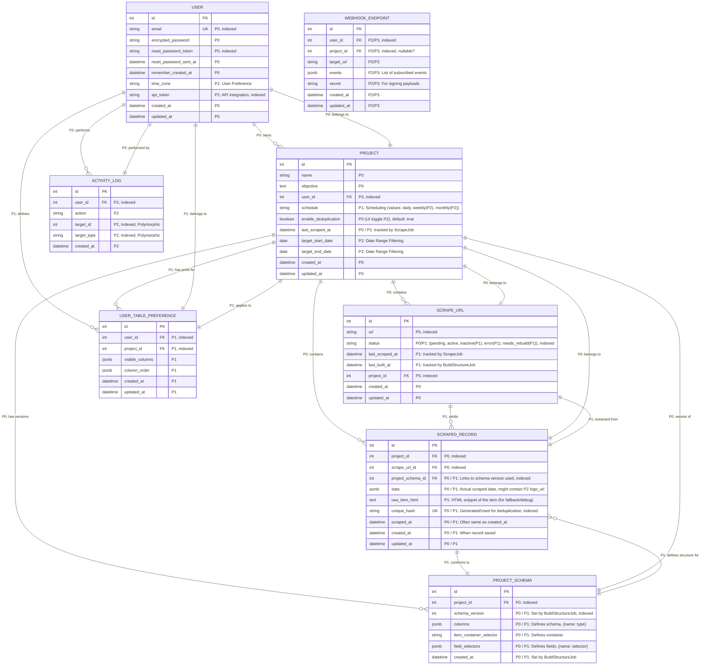
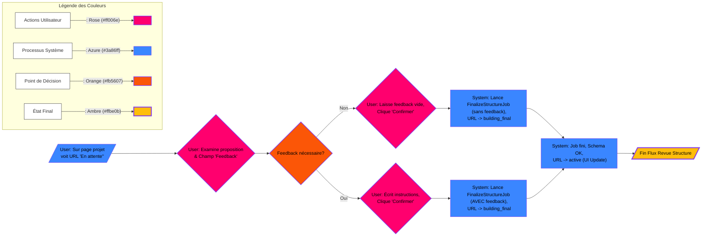
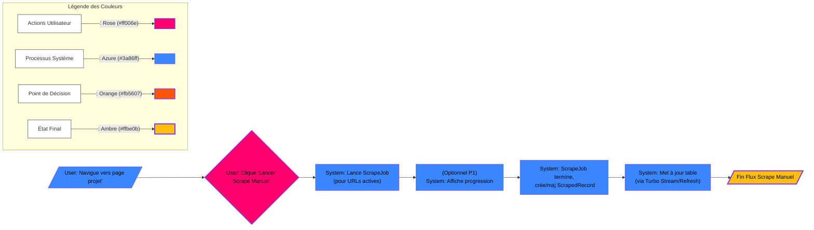
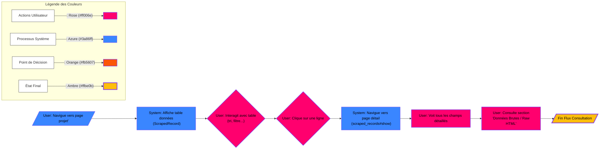
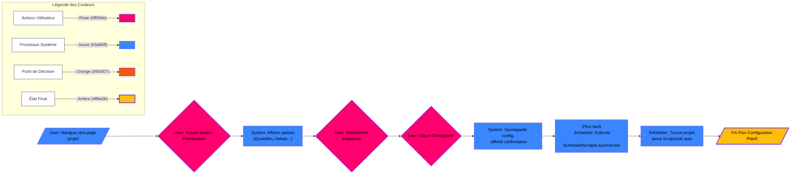

# PRD Business et Valeur Utilisateur

This Technical PRD contains the following elements that will help either a human or an LLM, or both, to complete teh vision of this project, using Windsurf IDE :

- PRD
- Checklist
- The Core of the App
- Prompts to include
- Development plan and File Structure
- Sitemap and sections
- ERD Entity Relationship Diagram
- DoD Definition of Done for the LLM and the Human
- Style Guide UI
- User Flows

## **Titre du SaaS : Universal Web Scraper**

**Date : 13 avril 2025**

## **Contexte et Problème**

Dans le domaine de l’extraction de données web, les outils actuels manquent de flexibilité et d’adaptabilité. Aujourd’hui, les utilisateurs doivent configurer manuellement des scrapers spécifiques pour chaque site ou plateforme (par exemple, Indeed, LinkedIn, Pinterest), ce qui entraîne une perte de temps, des coûts supplémentaires et une complexité accrue. Cette rigidité empêche les entreprises et les individus d’accéder rapidement et efficacement aux données dont ils ont besoin pour prendre des décisions éclairées.

## **Valeur pour l’Utilisateur et Opportunité Business**

**Universal Web Scraper** résout ce problème en offrant une solution innovante basée sur l’intelligence artificielle (IA). Grâce à un modèle avancé de LLM (Large Language Model), notre outil automatise l’adaptation du scraping à tout type de site web ou de contexte utilisateur. Cela permet aux utilisateurs de gagner du temps, de réduire les frais liés à la personnalisation manuelle, et d’accéder à des données structurées pertinentes sans compétence technique approfondie. 

Pour les entreprises, notre solution représente une opportunité de croissance dans un marché en expansion autour de l’extraction de données et de l’analyse automatisée. En proposant un produit intuitif et universel, nous visons à capter une large base d’utilisateurs, des PME aux grandes entreprises, tout en générant des revenus via un modèle SaaS basé sur des abonnements.

## **Objectif du Produit**

- **Pour les utilisateurs** : Fournir un outil de web scraping universel, intuitif et adaptable qui répond à leurs besoins spécifiques sans configuration complexe, tout en offrant une visualisation et une gestion avancées des données.
- **Pour l’entreprise** : Devenir leader dans le domaine du web scraping automatisé grâce à une solution basée sur l’IA, maximisant la satisfaction client et les revenus récurrents.

## **Proposition de Valeur**

- **Flexibilité** : Un scraper qui s’adapte automatiquement à n’importe quel site ou objectif grâce à l’IA.
- **Efficacité** : Réduction drastique du temps et des coûts liés à la configuration manuelle des scrapers.
- **Accessibilité** : Une interface utilisateur intuitive permettant à des non-techniciens d’extraire et de gérer des données complexes.
- **Personnalisation** : Des structures de données (tableaux, JSON, colonnes) générées dynamiquement en fonction des besoins spécifiques de l’utilisateur.

## **Cas d’Utilisation Prioritaires**

1. **Recherche d’emploi** : Extraire des offres d’emploi de plusieurs plateformes (Indeed, LinkedIn) dans une seule interface centralisée.
2. **Veille concurrentielle** : Collecter des données sur les prix ou produits de sites e-commerce pour analyser la concurrence.
3. **Recherche de contenu** : Agréger des articles ou publications sur des thématiques spécifiques à partir de divers médias ou blogs.
4. **Recherche de voyage** : Liste des voyage et des prix à chaque jour pour permettre à l'utilisateur de toujours avoir accès au nouveau prix.
5. **Recherche de voiture** : Un utilisateur doit pouvoir avoir une liste de tous les nouveaux posts concernant son véhicule X


---

# Checklist

Okay, voici une checklist priorisée (P0-P3) regroupant toutes les fonctionnalités des User Stories et du PRD, organisée par page/module parent. La priorité prend en compte la valeur utilisateur fondamentale et un flux de développement logique.

## Légende des Priorités :

*   **P0 : Indispensable (MVP Core)** - Fonctionnalités absolument nécessaires pour lancer le produit et démontrer sa valeur principale. d
*   **P1 : Haute Priorité** - Fonctionnalités très importantes qui complètent l'offre de base et répondent à des besoins utilisateurs clés rapidement après le lancement.
*   **P2 : Priorité Moyenne** - Fonctionnalités utiles améliorant l'expérience ou ajoutant de la valeur significative, mais pouvant attendre une itération ultérieure.
*   **P3 : Basse Priorité** - Fonctionnalités "Nice-to-have", avancées, ou moins critiques pour le lancement initial.
*   **Les status** sont à la fin de la ligne. Le LLM et l'humain opérateur doivent ajuster le status après leur manipulations. [Backlog] [To Do] [in Progress] [Test] [In Review] [Done]

---

## Checklist de Développement Priorisée

### I. Système d'Authentification & Gestion de Compte (Auth & Account)

*   **(P0)** **Système d'Authentification:** Permettre aux utilisateurs de s'inscrire et de se connecter avec email + mot de passe. [Backlog]
*   **(P1)** **Gestion des Identifiants:** Permettre à l'utilisateur de changer ses informations de connexion (mot de passe).[Backlog]
*   **(P2)** **Journal d'Activité:** Afficher l'historique des actions récentes (connexions, scrapes, erreurs, etc.).[Backlog]
*   **(P2)** **Préférences Utilisateur - Fuseau Horaire:** Permettre à l'utilisateur de choisir son fuseau horaire d'affichage.[Backlog]
*   **(P3)** **Support Multi-utilisateurs:** Gérer plusieurs utilisateurs (si pertinent pour des équipes/organisations, sinon plus bas).[Backlog]

### II. Tableau de Bord (Dashboard)

*   **(P1)** **Vue Globale (Statistiques):** Afficher les indicateurs clés : # projets, # scrapers actifs/inactifs, # URLs actives/inactives, # enregistrements totaux, statut rapide des scrapes programmés.[Backlog]

### III. Gestion des Projets (Project Creation & Configuration)
*(Concerne principalement la Page "Détail d'un Projet" et la logique de création)*

*   **(P0)** **Création de Projet:** Permettre à l'utilisateur de créer un projet en définissant un thème/objectif commun. [Backlog]
*   **(P0)** **Ajout/Gestion d'URLs:** Permettre à l'utilisateur d'ajouter une ou plusieurs URLs à un projet. [Backlog]
* **(P0) Revue Interactive de la Structure (Purpose Input & Feedback Loop):**

  Permettre à l'utilisateur de guider l'analyse initiale ('Purpose'), puis de revoir la structure proposée par l'IA (avec exemples), et de fournir un feedback pour correction avant finalisation. [Backlog]

  - *(Détails techniques associés :)* Le LLM analyse (basé sur 'Purpose'), propose une structure. L'UI affiche la proposition/exemples. L'utilisateur soumet un feedback (`user_feedback`). Le LLM raffine si nécessaire. Le `ProjectSchema` final est créé/mis à jour. [Backlog]
*   **(P0)** **Analyse Initiale & Construction de Structure (LLM - Backend)("Build Data Structure")** [Backlog]
    *   *(Action implicite avant le premier scrape)* Le LLM analyse les URLs, détermine les données pertinentes, nomme les colonnes, crée la structure JSON/table initiale, et sélectionne/configure le scraper approprié. [Backlog]
    *   *Features associées:* `LLM analyzes...`, `LLM names columns dynamically`, `LLM creates JSON dynamically`, `Platform automatically adapts table/DB structure (initial)`, `Platform automatically deploys best crawler (initial)`. [Backlog]
*   **(P0)** **Lancer un Scrape Manuel ("Scrape Now"):** Permettre de déclencher un scrape immédiatement pour le projet ou des URLs spécifiques. [Backlog]
*   **(P0)** **Scraping du Post Initial:** Assurer que le scraper récupère toujours le contenu original de la page, ceci sera utilile pour confimrer que les données sont correct et pour le déboggage (Données Brutes HTML) (détail technique d'implémentation). [Backlog]
*   **(P0) Un système de détection du système:** Si celui-ci tourne en boucle infini. si c'est le cas, le système soit arrêter, recevoir un diagnostique LLM, envoyer une erreur à l'interface du User et envoyer un courriel à l'administrateur avec le diagnostique du LLM, afin que l'administrateur puisse faire la correction au code de l'app. [Backlog]
*   **(P1)** **Activer/Désactiver une URL:** Permettre de mettre en pause le scraping pour une URL spécifique sans la supprimer. [Backlog]
*   **(P1) Heure UTC:** Ajouter dans les setting de l'utilisateur la fonctionnalité de pouvoir choisir l'horloge interne de l'application. Ex: UTC Toronto.
*   **(P1)** **Programmation Simple (Scheduling - Daily):** Permettre de programmer des scrapes quotidiens. [Backlog]
*   **(P1)** **Suivi Visuel (Progress Graph):** Afficher une barre/graphe de progression en temps réel pour les scrapes actifs. [Backlog]
*   **(P2)** **Programmation Avancée (Scheduling - Weekly, Monthly):** Ajouter des options de fréquence hebdomadaire et mensuelle. [Backlog]
*   **(P2)** **Sélection d'une Plage de Dates de Scraping:** Permettre de ne scraper que le contenu publié dans un intervalle de dates spécifique (peut être complexe). [Backlog]
*   **(P3)** **Configuration d'un Manifeste:** Permettre à l'utilisateur de définir des règles/limites spécifiques pour guider le scraper (fonctionnalité avancée). [Backlog]
*   

### IV. Visualisation des Données (Data Table - Project Details Page)

*   **(P0)** **Vue Table Simple (Pagination):** Afficher les données collectées dans un tableau paginé pour un chargement rapide. [Backlog]
*   **(P0)** **Fonctionnalités de Table Basiques:** Afficher les colonnes définies par l'IA, permettre le tri simple sur une colonne. [Backlog]
*   **(P1)** **Personnalisation de la Table (Affichage Colonnes):** Permettre à l'utilisateur de choisir quelles colonnes afficher/masquer. [Backlog]
*   **(P1)** **Fonctionnalités de Table Intermédiaires:** Permettre le déplacement (réorganisation) des colonnes. [Backlog]
*   **(P1)** **Vue Table Étendue ("Real DB"):** Offrir une option pour afficher toutes les lignes sans pagination (attention aux performances). [Backlog]
*   **(P2)** **Enrichissement Visuel (Logos Emplois):** Récupérer et afficher le logo de l'entreprise (via Google Favicon API, puis Clearbit API Free Tier en fallback) pour les projets de type "Emploi". [Backlog]
*   **(P2)** **Fonctionnalités de Table Avancées (Filtrage Basique):** Ajouter des options de filtrage simples par colonne. [Backlog]
*   **(P3)** **Filtres Avancés (Type Coda.io):** Implémenter un système de règles de filtrage complexes basé sur les types de colonnes/champs. [Backlog]
*   **(P3)** **Affichage Images:** Afficher les images téléchargées (si option activée au niveau projet) dans la table et/ou la modale. (Dépend de IX - Gestion Images) [Backlog]

### V. Interaction avec les Données (Lignes de Données & Page de Détail)

- **(P0)** **Page de Vue Détaillée:** Ouvrir une **page dédiée** (`/projects/:project_id/records/:id`) au clic sur une ligne, affichant tous les champs collectés pour cet enregistrement. [Backlog]
- **(P0)** **Vue des Données Brutes (Page Détail):** Inclure une section/onglet dans la **page détail** pour voir le HTML/JSON brut source ("Source of Truth"). [Backlog]
- **(P0)** **Sélection de Lignes (Checkbox):** Permettre de sélectionner une ou plusieurs lignes dans la table. [Backlog]
- **(P0)** **Action en Masse - Supprimer:** Permettre de supprimer les lignes sélectionnées. [Backlog]
- **(P1)** **Graphique de Progression:** Un graphique de progression permettant de voir l'avancement en % du scraping. Incluant les différentes phases écrite textuellement, qui sont une réflection des logs pertinent pour qu'un utilisateur comprennent à quelle étape se situe le progrès de son scraping. [Backlog]
- **(P3)** **Ajout/Gestion de Tags (par ligne & en masse):** Permettre d'ajouter/modifier des tags sur une ligne (**depuis la page détail** ou la table) et sur la sélection. [Backlog]
- **(P3)** **Ajout/Gestion de Statut (par ligne & en masse):** Permettre d'ajouter/modifier un statut sur une ligne (**depuis la page détail**) et sur la sélection. [Backlog]
- **(P3)** **Personnalisation des Champs (Page Détail):** Permettre à l'utilisateur de choisir/réorganiser les champs affichés dans la **page de vue détaillée**. [Backlog]
- **(P3)** **Action en Masse - "Change Selected List":** Permettre de marquer/démarquer des lignes comme appartenant à une liste "sélectionnée" (utilisation moins prioritaire que tags/status). [Backlog]

### VI. Gestion des Données & Export (Data Management)

*   **(P2)** **Export CSV:** Permettre d'exporter les données de la table (filtrées ou toutes) en format CSV. [Backlog]
*   **(P0)** **Déduplication ("Remove Duplicates"):** Implémenter une logique pour éviter d'ajouter des enregistrements identiques (basée sur une clé ou similarité). Ceci doit être une option dans le projet, car parfois c'est utile comme dans la recherche d'emplois, on ne veut pas avoir le même job post deux fois, mais dans el cas ou on recherche des voyages, cela reste le même posting, mais c'est le prix qui change, alors on veut quand même savoir que lOrsque l'on scrape, ce voyage est encore disponible, et à quel nouveau prix. [Backlog]

### VII. Recherche (Search)

*   **(P2)** **Recherche Contextuelle (Table):** Barre de recherche pour filtrer rapidement les données au sein de la table actuelle. [Backlog]
*   **(P3)** **Recherche Globale:** Barre de recherche permettant de chercher à travers tous les projets, URLs, et potentiellement les données collectées. [Backlog]

### VIII. Notifications

*   **(P2)** **Configuration des Notifications Email:** Permettre à l'utilisateur d'activer/configurer les notifications email pour les scrapes programmés. [Backlog]
*   **(P3)** **Réception des Notifications Email:** Envoyer un email avec un résumé du scrape et un lien vers la table lorsque le scrape programmé est terminé. [Backlog]

### IX. Moteur de Scraping & Intelligence (Core Engine - Backend/Implicit)
*(Ces éléments sont souvent transversaux ou backend, mais essentiels)*

*   **(P0)** **Adaptation Dynamique Structure (LLM):** L'IA adapte la structure de la BDD/table si de nouvelles données ou URLs le nécessitent (continu). [Backlog]
*   **(P0)** **Sélection/Déploiement Scraper (LLM):** L'IA choisit et utilise le meilleur modèle de scraper pour les URLs (continu). [Backlog]
*   **(P3)** **Modèles de Scraping Parallèles:** Exécuter plusieurs types de scrapers en simultané pour analyse comparative (optimisation avancée). [Backlog]
*   **(P3)** **Gestion & Stockage des Images (Optionnel):** Si activé par l'utilisateur pour le projet, télécharger les images associées, les redimensionner (qualité réduite), les stocker dans le cloud (ex: S3), et stocker la référence (URL cloud) avec les données. (Remplace/détaille l'ancien "Load images, URLs, cloud") [Backlog]

### X. Intégration & API (Integration & API)

- (P2)API d'Intégration: Développer une API REST (ou similaire) documentée [Backlog]
  - Accéder (Pull) aux données (projets, URLs, lignes de données, etc.). [Backlog]
  - Déclencher des actions (Push/Control) (ex: démarrer un scrape). [Backlog]
  - **(Optionnel P2/P3)** Recevoir des notifications via Webhooks. [Backlog]

---

Cette checklist fournit une base solide pour planifier vos sprints de développement, en commençant par les éléments P0 pour construire le cœur fonctionnel de l'application.


# Core Logic LLM, "The Brain"

Vous avez tout à fait raison de soulever ce point, c'est une préoccupation très légitime et absolument cruciale pour la viabilité économique et la performance de l'application ! L'idée d'utiliser le LLM pour traiter *chaque ligne individuelle* parmi des milliers serait effectivement prohibitive en termes de coûts et de temps d'exécution.

Le plan initial, tel que décrit, impliquait un peu trop implicitement l'utilisation du LLM pour l'extraction sur l'ensemble du contenu à chaque `Scrape Now`. **Clarifions et optimisons cela pour une approche beaucoup plus réaliste et rentable.**

## Approche Optimisée (Hybride: LLM pour la structure/adaptation, Selectors pour le volume):

L'objectif est de combiner la puissance d'adaptation du LLM avec l'efficacité des scrapers traditionnels (Nokogiri) pour l'extraction en volume.

1. `Build Data Structure` (Phase Initiale - Rôle Étendu du LLM):
   
    *   Le LLM analyse le HTML initial et l'objectif du projet.
    *   Il définit le schéma (colonnes, types).
    *   **NOUVEAU / PRÉCISION :** Il doit *aussi* identifier :
        *   **Le Sélecteur du Conteneur d'Item :** Quel élément HTML englobe chaque enregistrement individuel (par exemple, le `div` qui contient toutes les infos d'UNE offre d'emploi, ou d'UNE voiture listée).
        *   **Les Sélecteurs Relatifs des Champs :** Pour chaque colonne définie dans le schéma, quel est le sélecteur CSS ou XPath *relatif au conteneur d'item* qui permet de cibler la donnée (par exemple, `h2.job-title`, `.price-tag`, `img.vehicle-image[src]`).
    *   Ces sélecteurs (conteneur et relatifs) sont stockés, par exemple dans le `ProjectSchema` ou sur le modèle `ScrapeUrl`. C'est le **plan d'extraction** généré par l'IA.
    
2. `Scrape Now` (Exécutions Futures - Rôle Principal des Selectors, LLM en Supervision/Fallback):
   
    *   **Étape 1 : Fetch HTML Complet :** Récupérer le contenu à jour de la page (avec Mechanize, Selenium si besoin). Stocker ce HTML brut pour la vue "Données Brutes".
    *   **Étape 2 : Localiser les Conteneurs :** Utiliser Nokogiri et le `Sélecteur du Conteneur d'Item` stocké pour trouver *tous* les éléments HTML correspondant aux enregistrements individuels sur la page (potentiellement des centaines ou milliers).
    *   **Étape 3 : Extraction par Sélecteurs (pour chaque conteneur) :**
        *   Pour chaque `conteneur_html` trouvé :
            *   Utiliser Nokogiri et les `Sélecteurs Relatifs des Champs` stockés pour extraire les données spécifiques (titre, prix, date, etc.) *à l'intérieur de ce conteneur*.
            *   Construire l'objet `data` pour cet enregistrement.
    *   **Étape 4 : Validation & Fallback LLM (Crucial & Économique) :**
        *   **Option A (Validation Globale/Échantillon) :**
            *   Après avoir extrait quelques enregistrements (disons les 5-10 premiers) via les sélecteurs : **Valider** ces enregistrements. Est-ce que toutes les colonnes attendues sont présentes ? Les formats semblent-ils corrects ?
            *   **Si la validation réussit :** On suppose que le plan d'extraction (sélecteurs) est toujours valide pour cette page. Continuer à utiliser les sélecteurs Nokogiri pour les 990+ enregistrements restants. **=> Pas d'appel LLM ici, coût minimal.**
            *   **Si la validation échoue :** C'est le signal que la structure du site a probablement changé. **ICI, on fait intervenir le LLM**:
                *   Soit on envoie le HTML complet (ou juste la partie concernée) au LLM avec le schéma et on lui demande de **ré-analyser et fournir de NOUVEAUX sélecteurs** (un re-`Build`).
                *   Soit (plus coûteux mais plus direct), on demande au LLM d'**extraire les données** pour tous les enregistrements de cette page (fallback complet).
        *   **Option B (Validation par Item + Fallback Ciblé - Préférable) :**
            *   Pour *chaque* `conteneur_html` où l'extraction par sélecteur a été tentée :
                *   Valider *cet enregistrement spécifique*.
                *   **Si la validation réussit :** Super, on garde les données extraites par Nokogiri.
                *   **Si la validation échoue pour cet item :** Envoyer **UNIQUEMENT le HTML de ce petit conteneur** au LLM avec le schéma, et lui demander d'extraire les données juste pour *cet item*. **=> Coût LLM limité aux items qui posent problème.** Si un grand pourcentage échoue (>10-20%?), on peut déclencher une ré-analyse complète (Option A).
    *   **Étape 5 : Déduplication & Sauvegarde :** Traiter les données (validées par sélecteur ou extraites par LLM en fallback) pour la déduplication et sauvegarder les `ScrapedRecord`.

## Avantages de cette approche Hybride :

*   **Coût Maîtrisé :** Le LLM n'est sollicité que lors du `Build` initial, ou lors des `Scrape Now` *uniquement si* les sélecteurs échouent (ce qui indique un changement de site). La vaste majorité des extractions se fait via Nokogiri, qui est rapide et gratuit.
*   **Performance :** L'extraction via sélecteurs est beaucoup plus rapide que via LLM.
*   **Adaptabilité Conservée :** Le système peut détecter les changements (via l'échec des sélecteurs) et utiliser l'intelligence du LLM pour s'adapter ou extraire les données malgré le changement.
*   **Flexibilité :** On peut ajuster le seuil de déclenchement du fallback LLM.

## Conclusion:

Oui, le plan doit absolument intégrer cette optimisation. **Le LLM est essentiel pour le `Build Data Structure` afin de créer le schéma ET le plan d'extraction (sélecteurs). Pour les `Scrape Now`, les outils de scraping traditionnels (Nokogiri en tête) font le gros du travail en appliquant ces sélecteurs. Le LLM n'intervient en `Scrape Now` que comme mécanisme de validation ou de fallback ciblé lorsque les sélecteurs ne fonctionnent plus.**

Cela rend le projet beaucoup plus réaliste économiquement tout en conservant l'intelligence adaptative comme filet de sécurité. Le plan de développement détaillé précédent devra être ajusté pour refléter cette logique (stockage des sélecteurs, étapes de validation dans `ScrapeJob`, logique de fallback).


Okay, I understand the issue with Typora and nested or complex code fences. Let's try a different approach using **indented code blocks** for the main prompt text. Markdown generally handles indented code blocks (4 spaces indentation) very reliably across different editors, including Typora.

I will also make the sub-sections *within* the prompt template (like INSTRUCTIONS, EXPECTED OUTPUT) clearer using comments (`#`) inside the indented block, rather than Markdown headers, to avoid any potential formatting conflicts.

Here's the revised document structure:

---

# LLM Prompt Reference for `LlmClient` (Core Logic Prompt)

**Objective:** This document provides sample prompts designed for interacting with an external LLM API within the `LlmClient` service of the Universal Web Scraper application. These prompts cover the essential functions for structure analysis, fallback data extraction, and error diagnosis defined in Phase 1 of the development plan.

**Usage:** These prompt templates should be used by the Ruby code (within the corresponding `LlmClient` methods) by replacing the placeholders (`[PLACEHOLDER]`) with the appropriate dynamic data (HTML, objectives, errors, etc.) before sending the request to the LLM API.

---

## 1. Prompt for `LlmClient#analyze_for_schema_and_selectors`

### Usage Context
Called by `BuildStructureJob` during the initial analysis of a URL or when re-analysis is requested (status `needs_rebuild`). Aims to dynamically define how to scrape a page.

### Example Calling Code (Conceptual)
```ruby
# Inside BuildStructureJob
raw_html = FetcherService.fetch(scrape_url.url)
user_objective = project.objective
# existing_schema = project.project_schemas.order(version: :desc).first # For updates
prompt = generate_analyze_prompt(raw_html, user_objective, existing_schema) # Uses the template below
response_json = LlmClient.analyze_for_schema_and_selectors(prompt)
# ... (parsing and saving the result)
```

### Prompt Template Text

    # ROLE: Expert Web Scraping Analyst
    
    # TASK:
    # Analyze the provided HTML content for a website where the user's objective is "[USER_OBJECTIVE]".
    # Your goal is to determine the structure of the relevant data and provide the necessary CSS selectors for automated and efficient extraction.
    
    # INPUTS:
    # 1.  User Objective: "[USER_OBJECTIVE]" (E.g., "Job listings", "E-commerce products with prices", "Tech blog articles", "Used cars listed")
    # 2.  HTML Content of the Page:
    #     ```html
    #     [PAGE_HTML]
    #     ```
    #     *(Note: The HTML may be partial or cleaned if the page is very large)*
    # 3.  (Optional - For Updates) Existing Schema:
    #     ```json
    #     [EXISTING_SCHEMA_JSON]
    #     // If provided, consider this schema as a basis for adaptation.
    #     ```
    
    # INSTRUCTIONS:
    # 1.  Identify the Repeating Item Container: Find the most reliable and precise CSS selector that encloses *each individual instance* of the main element to be extracted (e.g., a `div` for a job listing, an `li` for a product).
    # 2.  Define the Data Schema: Propose a simple JSON structure for the relevant data to be extracted, based on the user objective (and the existing schema if provided). Include column names (JSON keys) and their likely data type (e.g., `string`, `number`, `date`, `url`, `image_url`). Focus on the most important information.
    # 3.  Identify Relative Field Selectors: For *each* column defined in your schema, provide the most precise CSS selector that allows extracting this specific data *within* the item container identified in step 1. These selectors MUST be relative to the container.
    
    # EXPECTED OUTPUT FORMAT (Strict JSON):
    # Please provide your response exclusively in the form of a valid JSON object with the following keys:
    # ```json
    # {
    #   "item_container_selector": "CONTAINER_CSS_SELECTOR",
    #   "columns": {
    #     "column_name_1": "data_type_1",
    #     "column_name_2": "data_type_2",
    #     // ... other columns
    #   },
    #   "field_selectors": {
    #     "column_name_1": "RELATIVE_CSS_SELECTOR_1",
    #     "column_name_2": "RELATIVE_CSS_SELECTOR_2",
    #     // ... selectors for each column
    #   }
    # }
    # ```
    
    # IMPORTANT:
    # *   Ensure that the `field_selectors` are indeed relative to the `item_container_selector`.
    # *   Provide only the JSON as the response. No explanatory text before or after.

*(Note: The example HTML and JSON within the prompt text are still shown using triple backticks for clarity *within the prompt itself*, but the entire prompt block is enclosed using 4-space indentation which should render consistently in Typora)*

---

## 2. Prompt for `LlmClient#extract_data_for_item`

### Usage Context
Called by `ScrapeJob` when an attempt to extract data using the pre-defined CSS selectors (obtained via prompt #1) fails for a specific HTML item. This is the fallback mechanism.

### Example Calling Code (Conceptual)
```ruby
# Inside ScrapeJob, loop over items
item_html = item_node.to_html
schema_columns = project_schema.columns # E.g., {"title"=>"string", "price"=>"number"}

# If selector extraction fails or is invalid...
prompt = generate_extract_prompt(item_html, schema_columns) # Uses the template below
fallback_data_json = LlmClient.extract_data_for_item(prompt)
# ... (use fallback_data_json for this item)
```

### Prompt Template Text

    # ROLE: Targeted Data Extractor
    
    # TASK:
    # Extract the information specified by the `TARGET_SCHEMA` from the provided `ITEM_HTML_SNIPPET`.
    # This is a fallback attempt because standard extraction via CSS selectors failed for this item.
    
    # INPUTS:
    # 1.  HTML Snippet of the Item:
    #     ```html
    #     [ITEM_HTML_SNIPPET]
    #     ```
    # 2.  Target Schema (Expected columns - JSON format):
    #     ```json
    #     [TARGET_SCHEMA_COLUMNS_JSON]
    #     // Example: {"job_title": "string", "company_name": "string", "location": "string", "posted_date": "date"}
    #     ```
    
    # INSTRUCTIONS:
    # 1.  Analyze the `ITEM_HTML_SNIPPET`.
    # 2.  For each key (column name) present in the `TARGET_SCHEMA_COLUMNS_JSON`, extract the corresponding value from the HTML snippet.
    # 3.  If a value for a specific schema key is not found or cannot be reliably extracted, return `null` for that key.
    
    # EXPECTED OUTPUT FORMAT (Strict JSON):
    # Please provide your response exclusively in the form of a valid JSON object containing the extracted data.
    # The keys of this object must exactly match the keys from `TARGET_SCHEMA_COLUMNS_JSON`.
    # ```json
    # {
    #   "column_name_1": "extracted_value_1 or null",
    #   "column_name_2": "extracted_value_2 or null",
    #   // ... other schema columns
    # }
    # ```
    
    # IMPORTANT:
    # *   Return only the JSON. No explanations.
    # *   Strictly adhere to the keys defined in `TARGET_SCHEMA_COLUMNS_JSON`.

---

## 3. Prompt for `LlmClient#diagnose_scraping_issue`

### Usage Context
Called by `ScrapeJob` within a `rescue` block or after detecting a threshold of repetitive errors (e.g., Timeout, network errors, Nokogiri errors) for a specific URL. Aims to get diagnostic help for the administrator.

### Example Calling Code (Conceptual)
```ruby
# Inside ScrapeJob, rescue block for a URL
rescue Timeout::Error, Net::ReadTimeout => e
  # ... (logic for counting repetitive errors)
  if error_count > MAX_RETRIES
    error_message = e.message + "\n" + e.backtrace.first(5).join("\n")
    html_context = # ... (potentially problematic HTML, if available)
    prompt = generate_diagnose_prompt(scrape_url.url, error_message, html_context) # Uses template below
    diagnosis = LlmClient.diagnose_scraping_issue(prompt)
    # ... (Notify admin with diagnosis, mark URL as error)
  end
end
```

### Prompt Template Text

    # ROLE: Expert Web Scraping Debugger
    
    # TASK:
    # Analyze the provided error information regarding a scraping task that failed repeatedly on a specific URL.
    # Provide a likely diagnosis of the root cause and suggest concrete corrective actions.
    # The suspected issue could potentially be an infinite loop, a repetitive timeout, or a persistent parsing error.
    
    # INPUTS:
    # 1.  Affected URL: "[URL]"
    # 2.  Error Message(s) / Logs:
    #     ```text
    #     [ERROR_MESSAGE_OR_LOG_SNIPPET]
    #     // Example: "Timeout::Error: execution expired after 60 seconds" OR "Nokogiri::XML::SyntaxError: Tag not finished" OR "Net::ReadTimeout with #<TCPSocket:(closed)>" (on multiple attempts)
    #     ```
    # 3.  (Optional) HTML Context (can be the full page or problematic section if identified):
    #     ```html
    #     [HTML_CONTEXT]
    #     // If not provided, indicate "Not available".
    #     ```
    
    # INSTRUCTIONS:
    # 1.  Examine the error messages and HTML context (if provided) in relation to the URL.
    # 2.  Identify the most likely cause of the repetitive failure. Consider possibilities such as:
    #     *   Misconfigured CSS selectors (container or fields) leading to loops or missing data.
    #     *   Anti-scraping protection (CAPTCHA, IP blocking, behavioral detection, unhandled dynamic loading).
    #     *   Content rendered heavily by JavaScript that is not captured by the current fetch tool (e.g., Mechanize).
    #     *   Invalid or severely malformed HTML structure causing recurring parsing errors.
    #     *   Significant changes on the target page since the last structure analysis.
    #     *   Intermittent network issues or restrictive server configurations on the target side.
    # 3.  Provide a clear and concise explanation of the most likely diagnosis.
    # 4.  Suggest concrete technical steps to resolve the issue or investigate further (e.g., "Check/modify CSS selector '[suspected_selector]', it seems too generic.", "Attempt using a browser-based fetcher (Selenium/Puppeteer) for this URL as complex JS rendering is suspected.", "Manually inspect the HTML structure at the URL via browser Developer Tools.", "Increase the timeout for this URL / Add delays between requests.", "Consider User-Agent or Proxy rotation.", "Flag the URL for a full structure re-analysis via `BuildStructureJob`.").
    
    # EXPECTED OUTPUT FORMAT (Clear Text):
    # Respond in plain text, clearly structuring your diagnosis and suggestions.
    # Example Response Structure:
    #
    # Likely Diagnosis:
    # [Explain the most probable cause of the repetitive error here, based on the provided information.]
    #
    # Suggestions for Correction / Investigation:
    # 1.  [Specific action / check 1]
    # 2.  [Specific action / check 2]
    # 3.  [Other relevant action or debugging step]


# Le plan de développement

## Philosophie Générale (Conservée et Renforcée):

*   **Hybride par Conception:** LLM = cerveau (compréhension/adaptation), Scrapers classiques = bras (extraction volume).
*   **Itératif:** Fondations P0 (avec cœur hybride + logs), puis couches P1, P2, P3.
*   **Piloté par les Tests (TDD/BDD):** Valider sélecteurs ET fallback LLM.
*   **Modulaire:** Services Objects (LLM Interaction, Fetcher, Extraction Logic, Notifier).
*   **Background Jobs (GoodJob):** `BuildStructureJob`, `ScrapeJob`, et autres tâches longues.
*   **Sécurité & Bonnes Pratiques Rails.**
*   **Hotwire:** Turbo Drive, Frames, Streams (Feedback job), Stimulus (UI), Morph (Tables?).
*   **Logging Verbeux:** Journalisation console (`Rails.logger`) systématique pour suivi/debug.
*   **Scalabilité:** Architecture pensée pour évoluer (Rails, Postgres, GoodJob, Fly.io).
*   **Clear naming convention:**  Prioritize clear naming conventions, small functions/methods, logical structure, and adherence to design patterns. This makes the code itself the primary source of truth.


## File Structure

universal_web_scraper/
├── .git/
├── .github/
│   └── workflows/
│       └── deploy.yml
├── .gitignore
├── .env                 # **IN .gitignore**
├── Gemfile
├── Gemfile.lock
├── README.md            # Links to /docs/*
├── Rakefile
├── bin/
│   ├── bundle
│   ├── rails
│   ├── setup
│   └── dev
├── config/
│   ├── application.rb
│   ├── boot.rb
│   ├── cable.yml
│   ├── database.yml
│   ├── environment.rb
│   ├── environments/
│   │   ├── development.rb
│   │   ├── production.rb
│   │   └── test.rb
│   ├── initializers/    # Holds devise.rb, good_job.rb, pagy.rb etc. after config
│   ├── locales/
│   ├── puma.rb
│   ├── routes.rb
│   ├── storage.yml
│   ├── master.key       # **IN .gitignore if repo is public**
│   └── credentials.yml.enc
├── app/
│   ├── assets/
│   │   ├── builds/
│   │   ├── config/
│   │   ├── images/
│   │   └── stylesheets/
│   │       └── application.bootstrap.scss # Correct for Bootstrap
│   ├── channels/
│   ├── controllers/
│   │   ├── application_controller.rb
│   │   ├── concerns/
│   │   ├── api/
│   │   │   └── v1/
│   │   │       ├── base_controller.rb
│   │   │       ├── projects_controller.rb # API specific
│   │   │       └── # ...
│   │   ├── dashboard_controller.rb
│   │   ├── projects_controller.rb
│   │   ├── scrape_urls_controller.rb
│   │   ├── scraped_records_controller.rb # Handles show (recDetail) & index (expandData)
│   │   ├── user_table_preferences_controller.rb
│   │   ├── settings_controller.rb         # <-- ADDED for Timezone, Notifications, API/Webhook config UI
│   │   ├── activity_logs_controller.rb    # <-- ADDED for viewing activity (P2)
│   │   └── webhook_endpoints_controller.rb # <-- ADDED for managing CRUD of webhooks (P2/P3)
│   ├── helpers/
│   ├── javascript/
│   │   ├── application.js
│   │   └── controllers/                   # Stimulus controllers live here
│   │       ├── hello_controller.js        # Default example
│   │       ├── table_selection_controller.js # Example P0
│   │       ├── progress_graph_controller.js # Example P1
│   │       ├── column_visibility_controller.js # Example P1
│   │       └── # ... more Stimulus controllers as needed
│   ├── jobs/
│   │   ├── application_job.rb
│   │   ├── build_structure_job.rb 
│   │   ├── finalize_structure_job.rb     #(Utilise user_feedback P1) 
│   │   ├── scrape_job.rb
│   │   ├── scheduled_scrape_launcher_job.rb
│   │   ├── csv_export_job.rb
│   │   ├── webhook_send_job.rb
│   │   ├── image_processing_job.rb        # P3
│   │   └── logo_enrichment_job.rb         # P2 (alternative to Service)
│   ├── mailers/
│   │   ├── application_mailer.rb
│   │   ├── scrape_completion_mailer.rb   # P3
│   │   └── admin_notification_mailer.rb  # For errors (P0 loop detect)
│   ├── models/
│   │   ├── application_record.rb
│   │   ├── concerns/
│   │   ├── user.rb
│   │   ├── project.rb
│   │   ├── scrape_url.rb    # Contient 'purpose' et 'user_feedback'
│   │   ├── project_schema.rb
│   │   ├── scraped_record.rb
│   │   ├── user_table_preference.rb
│   │   ├── activity_log.rb
│   │   ├── webhook_endpoint.rb
│   │   └── # ... other models
│   ├── services/
│   │   ├── llm_client.rb
│   │   ├── fetcher_service.rb
│   │   ├── webhook_notifier_service.rb   # P2/P3
│   │   └── logo_enricher_service.rb      # P2 (alternative to Job)
│   └── views/
│       ├── layouts/
│       │   └── application.html.erb      # Main layout
│       ├── shared/                       # Common partials (_navbar.html.erb, _flash_messages.html.erb)
│       ├── devise/                       # Standard Devise views
│       ├── dashboard/
│       │   └── index.html.erb
│       ├── projects/                     # index, show, new, _form, partials for project details
│       ├── scrape_urls/                  # Partials used within projects/show (_scrape_url.html.erb)
│       ├── scraped_records/              # index (expandData), show (recDetail), partials (_record.html.erb, _table.html.erb)
│       ├── user_table_preferences/       # Partials for column settings modal (_form.html.erb)
│       ├── settings/                     # Views for general settings (show.html.erb) <-- ADDED
│       ├── activity_logs/                # View for activity log (index.html.erb) <-- ADDED
│       ├── webhook_endpoints/            # CRUD views for webhooks (index, new, show, _form) <-- ADDED
│       ├── scrape_completion_mailer/     # Email templates <-- ADDED
│       └── admin_notification_mailer/    # Email templates <-- ADDED
├── db/
│   ├── migrate/
│   ├── schema.rb
│   └── seeds.rb
├── docs/                     # Detailed documentation
│   ├── 01_prd_business_value.md
│   ├── 02_checklist.md
│   ├── 03_core_logic.md
│   ├── 04_development_plan.md
│   ├── 05_prompts.md
│   ├── 06_sitemap.md
│   ├── 07_erd.md
│   ├── 08_definition_of_done.md
│		├── 09_style_guide.md       # Your style guide (colors, etc.)
│   └── 10 user_flows/             # Subdirectory for flows
│       ├── 01_onboarding.md          # Mermaid code for Flow 1
│       ├── 02_structure_review.md    # Mermaid code for Flow 2
│       ├── 03_manual_scrape.md       # Mermaid code for Flow 3
│       ├── 04_data_consultation.md   # Mermaid code for Flow 4
│       └── 05_scheduled_scrape.md  	# Mermaid code for Flow 5
├── lib/
│   ├── assets/
│   └── tasks/
├── log/
├── public/
├── storage/
├── test/                     # Or `spec/`
├── tmp/
├── vendor/
└── fly.toml

## Plan de Développement Détaillé (Approche Hybride + Revue Interactive + Logging)

### Phase 0 : Fondations et Configuration (Pré-requis Techniques - P0)

*   **1. Initialisation du Projet Ruby on Rails:**
    *   `- Implémentation:` `rails new universal_web_scraper --database=postgresql -j esbuild --css bootstrap`, config DB, Init Git.
    *   `- Log:` `Rails.logger.info "Rails project initialized. Version: #{Rails.version}"`
*   **2. Ajout des Gems Essentielles:**
    *   `- Implémentation:` `devise`, `hotwire-rails`, `good_job`, `pg`, `dotenv-rails`, `httparty`/`faraday`, `nokogiri`, `mechanize`, `capybara`, `selenium-webdriver`, `pagy`. `bundle install`.
    *   `- Log:` `Rails.logger.info "Essential gems loaded: Devise, GoodJob, Nokogiri, Pagy..."`
*   **3. Configuration de Base:**
    *   `- Implémentation:` `rails g devise:install`, `rails g devise User`. Configurer GoodJob (`rails g good_job:install`, migrer). Configurer `dotenv`. Mettre en place framework de test.
    *   `- Log (Initializer ou `config/application.rb`):`
        *   `Rails.logger.info "Application starting in #{Rails.env} mode."`
        *   `Rails.logger.info "Background job adapter: GoodJob (Postgres backend)."`
        *   `Rails.logger.info "LLM API Key Loaded: #{ENV['LLM_API_KEY'].present?}"`
        *   `Rails.logger.info "Database connection established."`
*   **4. Modèles de Base & Relations (P0):**
    *   `- Implémentation:`
        *   Créer modèles `User`, `Project`.
        *   Créer modèle `ScrapeUrl` avec colonnes: `url:string`, `status:string` (statuts initiaux : `pending`, `active`, `inactive`, `error`), `project_id:references`, `purpose:text` (obligatoire, décrit l'objectif du scrape).
        *   Créer modèle `ProjectSchema` avec colonnes: `columns:jsonb`, `item_container_selector:string`, `field_selectors:jsonb`, `schema_version:integer`, `project_id:references`.
        *   Créer modèle `ScrapedRecord` avec colonnes: `project_id:references`, `scrape_url_id:references`, `project_schema_id:references`, `data:jsonb`, `unique_hash:string`, `raw_item_html:text`.
        *   Définir relations (`belongs_to`, `has_many`), exécuter migrations, ajouter index (`status`, `unique_hash`, FKs), ajouter validation `presence: true` sur `ScrapeUrl.purpose`.
    *   `- Log:`
        *   `Rails.logger.info "Database schema migrated successfully (P0 Models). Models: User, Project, ScrapeUrl(with purpose), ProjectSchema, ScrapedRecord."`
*   **5. Configuration Fly.io:**
    *   `- Implémentation:` `flyctl` install, `fly launch`, config secrets (DB, Rails Master Key, LLM Key), adapter `fly.toml`, deploy initial.
    *   `- Log:` (Via `flyctl` et logs Fly.io).

---

### Phase 1 : Cœur Fonctionnel & Revue Interactive (P0 Core + P1 Review Flow)

*   **1. Service d'Interaction LLM (`LlmClient`):**
    *   `- Implémentation (P0 - Méthode `analyze_for_schema_and_selectors`):` Prend HTML et le `purpose` (obligatoire, depuis `ScrapeUrl.purpose`). Prompt demande schema/sélecteurs guidé par cet objectif initial.
    *   `- Log (P0 - Méthode `analyze_...`):`
        *   `Rails.logger.debug "[LlmClient] Calling analyze_for_schema_and_selectors..."`
        *   `Rails.logger.info "[LlmClient] Using purpose '#{purpose.truncate(50)}' to guide analysis."`
        *   `Rails.logger.info "[LlmClient] Sending request to LLM API for schema/selector analysis. Model: #{configured_model}, Prompt length approx: #{prompt.length}"`
        *   `Rails.logger.info "[LlmClient] Received response from LLM API. Status: #{response.code}"`
        *   `Rails.logger.error "[LlmClient] LLM API Error: #{error.message}. Response: #{response.body}"`
        *   `Rails.logger.debug "[LlmClient] analyze_for_schema_and_selectors completed. Found item selector: '#{result[:item_container_selector]}'. Columns: #{result[:columns]&.keys&.join(', ')}"`
    *   `- Implémentation (P0 - Méthode `extract_data_for_item`):` Prend HTML item, schema. Prompt fallback.
    *   `- Log (P0 - Méthode `extract_...`):`
        *   `Rails.logger.debug "[LlmClient] Calling extract_data_for_item for a single item..."`
        *   `Rails.logger.info "[LlmClient] Sending request to LLM API for fallback data extraction. Item HTML length: #{item_html.length}"`
        *   (Logs après appel similaires à `analyze_...`)
    *   `- Implémentation (P0 - Méthode `diagnose_scraping_issue`):` Prend logs erreur, HTML. Prompt diagnostic.
    *   `- Log (P0 - Méthode `diagnose_...`):`
        *   `Rails.logger.debug "[LlmClient] Calling diagnose_scraping_issue..."`
        *   (Logs avant/après appel similaires)
        *   `Rails.logger.info "[LlmClient] LLM diagnosis received: #{diagnosis_text}"`
    *   `- Implémentation (P1 - Méthode `refine_schema_from_feedback`):` Prend HTML original, `proposed_data` (`ScrapeUrl`), et `user_feedback` (optionnel, depuis `ScrapeUrl.user_feedback` - pour les *corrections*). Si `user_feedback` est présent, nouveau prompt LLM pour ajuster la proposition initiale basé sur les corrections demandées. Retourne structure JSON finale (soit raffinée, soit l'originale si pas de feedback).
    *   `- Log (P1 - Méthode `refine_...`):`
        *   `Rails.logger.debug "[LlmClient] Calling refine_schema_from_feedback..."`
        *   `Rails.logger.info "[LlmClient] Sending request to LLM API for schema refinement. Proposed keys: #{proposed_data.keys}, Corrections Feedback Provided: #{user_feedback.present?}"`
        *   `Rails.logger.info "[LlmClient] Received response from LLM API (refinement). Status: #{response.code}"` (Seulement si appelé)
        *   `Rails.logger.error "[LlmClient] LLM API Refinement Error: #{error.message}. Response: #{response.body}"` (Seulement si appelé et erreur)
        *   `Rails.logger.debug "[LlmClient] refine_schema_from_feedback completed. Final schema columns: #{result[:columns]&.keys&.join(', ')}"`

*   **2. Modifications Modèle `ScrapeUrl` (P1):**
    *   `- Implémentation (P1):`
        *   Créer une migration pour ajouter les colonnes `proposed_data:jsonb`, `user_feedback:text` (ce champ est pour les *corrections optionnelles*).
        *   Mettre à jour la définition des statuts pour inclure `analyzing`, `pending_review`, `building_final`, `needs_rebuild`.
        *   Mettre à jour le code du modèle (`enum` ou constantes) pour refléter les nouveaux statuts.
    *   `- Log (P1 - Migration):`
        *   `Rails.logger.info "Database schema migrated successfully (P1 ScrapeUrl additions: proposed_data, user_feedback for corrections, new statuses)."`

*   **3. Job "Build Initial Structure" (`BuildStructureJob` - P1):**
    *   `- Implémentation (P1):`
        *   Input: `scrape_url_id`.
        *   Récupère `ScrapeUrl` (incluant le champ `purpose`).
        *   Change status `scrape_url` -> `analyzing`.
        *   Fetch HTML via `FetcherService`.
        *   Appel `LlmClient.analyze_for_schema_and_selectors(html, scrape_url.purpose)`.
        *   Parse la réponse LLM.
        *   Stocke la réponse complète (schéma, sélecteurs, etc.) dans `scrape_url.proposed_data`.
        *   *Optionnel mais recommandé:* Tenter d'extraire 1-2 items d'exemple et les stocker dans `scrape_url.proposed_data['examples']`.
        *   Change status `scrape_url` -> `pending_review`.
        *   Broadcast le statut `pending_review` via Turbo Streams.
        *   Termine le job.
    *   `- Log (P1):`
        *   `Rails.logger.info "[BuildStructureJob(#{job.job_id})] Starting P1 initial analysis for ScrapeUrl ID: #{scrape_url_id}"`
        *   `Rails.logger.info "[BuildStructureJob(#{job.job_id})] Using Purpose: '#{scrape_url.purpose.truncate(80)}'"`
        *   `Rails.logger.info "[BuildStructureJob(#{job.job_id})] Fetching initial HTML for URL: #{scrape_url.url}"`
        *   `Rails.logger.info "[BuildStructureJob(#{job.job_id})] HTML fetched (Size: #{raw_html.size} bytes). Status: #{response_status}"` (Ou `.error`)
        *   `Rails.logger.info "[BuildStructureJob(#{job.job_id})] Calling LLMClient.analyze_for_schema_and_selectors..."`
        *   `Rails.logger.info "[BuildStructureJob(#{job.job_id})] LLM analysis complete."` (Ou `.error`)
        *   `Rails.logger.info "[BuildStructureJob(#{job.job_id})] Storing proposed schema and examples in ScrapeUrl ID: #{scrape_url_id}. Proposed columns: #{proposed_data['columns']&.keys&.join(', ')}"`
        *   `Rails.logger.info "[BuildStructureJob(#{job.job_id})] Setting status to 'pending_review' for ScrapeUrl ID: #{scrape_url_id}."`
        *   `Rails.logger.info "[BuildStructureJob(#{job.job_id})] Broadcasting 'pending_review' status via Turbo Streams."`
        *   `Rails.logger.info "[BuildStructureJob(#{job.job_id})] P1 initial analysis job completed successfully."` (Ou `.error` dans `rescue`)

*   **4. Service de Fetch (`FetcherService` - P0):**
    *   `- Implémentation (P0):` Méthode `fetch(url)`. `Mechanize`, gestion erreurs.
    *   `- Log (P0):`
        *   `Rails.logger.debug "[FetcherService] Fetching URL: #{url} using Mechanize..."`
        *   `Rails.logger.info "[FetcherService] Successfully fetched URL: #{url}. Status: #{response.code}, Size: #{body.size}"`
        *   `Rails.logger.error "[FetcherService] Failed to fetch URL: #{url}. Error: #{error.class} - #{error.message}"`

*   **5. Job "Finalize Structure" (`FinalizeStructureJob` - P1):**
    *   `- Implémentation (P1):`
        *   Input: `scrape_url_id`.
        *   Change status `scrape_url` -> `building_final`.
        *   Récupère `scrape_url` (chargeant `proposed_data` et `user_feedback` (corrections)).
        *   Récupère le HTML original.
        *   Si `scrape_url.user_feedback.present?`, appel `LlmClient.refine_schema_from_feedback(html, proposed_data, scrape_url.user_feedback)`. Sinon, utiliser `proposed_data` directement comme structure finale.
        *   Parse la structure finale obtenue.
        *   Crée ou met à jour le `ProjectSchema` du projet associé (incrémente `schema_version`).
        *   Change status `scrape_url` -> `active` (si succès) ou `error` (si échec LLM ou parsing).
        *   Broadcast le statut final (`active` ou `error`) via Turbo Streams.
        *   Termine le job.
    *   `- Log (P1):`
        *   `Rails.logger.info "[FinalizeStructureJob(#{job.job_id})] Starting schema finalization for ScrapeUrl ID: #{scrape_url_id}."`
        *   `Rails.logger.info "[FinalizeStructureJob(#{job.job_id})] User corrections provided: #{scrape_url.user_feedback.present?}"`
        *   `Rails.logger.info "[FinalizeStructureJob(#{job.job_id})] Calling LLMClient.refine_schema_from_feedback..."` (Si feedback présent)
        *   `Rails.logger.info "[FinalizeStructureJob(#{job.job_id})] LLM refinement complete."` (Si appelé et succès)
        *   `Rails.logger.debug "[FinalizeStructureJob(#{job.job_id})] Parsed final LLM response. Validation passed."` (Si appelé et succès)
        *   `Rails.logger.info "[FinalizeStructureJob(#{job.job_id})] Saving FINAL ProjectSchema version: #{new_schema_version} for Project ID: #{project.id}"`
        *   `Rails.logger.info "[FinalizeStructureJob(#{job.job_id})] Setting status to '#{final_status}' for ScrapeUrl ID: #{scrape_url_id}."`
        *   `Rails.logger.info "[FinalizeStructureJob(#{job.job_id})] Broadcasting final status '#{final_status}' via Turbo Streams."`
        *   `Rails.logger.info "[FinalizeStructureJob(#{job.job_id})] Schema finalization job completed successfully."` (Ou `.error` dans `rescue`)

*   **6. Job "Scrape Now" (`ScrapeJob` - P0 / adapté P1):**
    *   `- Implémentation (P0):` Logique hybride (sélecteurs + fallback LLM), gestion erreurs répétitives/timeout global, déduplication, broadcast progression.
    *   `- Implémentation (Adaptations P1):`
        *   Avant de traiter une `ScrapeUrl`, vérifier son `status`. Ne traiter que si `active`. Si autre (`pending`, `pending_review`, `analyzing`, `building_final`, `error`, `needs_rebuild`), logger et ignorer pour ce run.
        *   Si la logique d'auto-adaptation détecte une dérive (> X% selector failures):
            *   Changer le `scrape_url.status` à `needs_rebuild`.
            *   Enqueue `BuildStructureJob.perform_later(scrape_url.id)`.
    *   `- Log (P0/P1):`
        *   _...(Conserver tous les logs P0 définis précédemment)..._
        *   `Rails.logger.warn "[ScrapeJob(#{job.job_id})] Skipping URL ID: #{scrape_url.id}. Status is '#{scrape_url.status}', expected 'active'."`
        *   `Rails.logger.warn "[ScrapeJob(#{job.job_id})] High selector failure rate (...) for URL ID: #{scrape_url.id}. Marking as 'needs_rebuild' and enqueuing BuildStructureJob."`

---

### Phase 2 : Interface Utilisateur & Fonctionnalités de Base (MVP UI - P0 + Review UI - P1)

*   **1. Authentification UI (P0):**
    *   `- Implémentation (P0):` `rails g devise:views`. Style. Routes.
    *   `- Log (P0):` (Logs Devise).
*   **2. Gestion des Projets (CRUD Basique - P0):**
    *   `- Implémentation (P0):` `ProjectsController` (new, create, show, index). Vues Hotwire.
    *   `- Log (P0):`
        *   `Rails.logger.info "[ProjectsController] User #{current_user&.id || 'Guest'} accessed #{action_name} action."`
        *   (Create/Update/Destroy) `Rails.logger.info "[ProjectsController] User #{current_user&.id} #{action_name}d Project ID: #{@project.id}"`
*   **3. Page `projects#show` (Affichage Initial & Actions - P0/P1):**
    *   `- Implémentation (P0):`
        *   Afficher détails projet.
        *   Formulaire `form_with` (dans Turbo Frame?) pour ajouter `ScrapeUrl` au projet:
            *   Champ URL (obligatoire).
            *   Champ `textarea` pour `purpose` (obligatoire) avec libellé: "Quel est le but principal du scraping de cette URL ? Ex: Extraire les offres d'emploi, les prix des produits, ...".
        *   Lister les `ScrapeUrl` associées (url, status P0).
        *   Bouton "Lancer Scrape Manuel" (déclenche `ScrapeJob` pour le projet).
        *   Bouton "Analyser Structure" par URL (déclenche `BuildStructureJob` P1).
    *   `- Implémentation (P1 - Routes & Controller Action):`
        *   `config/routes.rb`: Ajouter `resources :scrape_urls, only: [] do member { post :submit_review } }`.
        *   Créer/Modifier `ScrapeUrlsController` pour avoir une action `submit_review`:
            *   Trouve `ScrapeUrl` par `params[:id]`.
            *   Met à jour `scrape_url.user_feedback` avec `params[:user_feedback]` (ou un nom similaire du formulaire).
            *   Enqueue `FinalizeStructureJob.perform_later(scrape_url.id)`.
            *   Répond avec succès (ex: `head :ok` ou Turbo Stream).
    *   `- Log (P1 - Controller `submit_review`):`
        *   `Rails.logger.info "[ScrapeUrlsController#submit_review] User #{current_user&.id} submitted corrections feedback for ScrapeUrl ID: #{params[:id]}."`
        *   `Rails.logger.info "[ScrapeUrlsController#submit_review] Stored corrections feedback length: #{scrape_url.user_feedback.length}"`
        *   `Rails.logger.info "[ScrapeUrlsController#submit_review] Enqueuing FinalizeStructureJob for ScrapeUrl ID: #{params[:id]}."`
    *   `- Implémentation (P1 - Logique d'Affichage `projects#show` - Affichage Statuts & Review):`
        *   La section listant les `ScrapeUrl` doit afficher les statuts P1 (`analyzing`, `pending_review`, `building_final`, `needs_rebuild`, etc.) avec des badges/textes clairs.
        *   Utiliser `turbo_frame_tag` pour chaque `ScrapeUrl` listée (`dom_id(scrape_url)`).
        *   Pour chaque `ScrapeUrl`, si `scrape_url.status == 'pending_review'`:
            *   Afficher une section "Revue de la Structure" à l'intérieur du `turbo_frame_tag`.
            *   Bloc de Révision contient :
                *   Le schéma proposé (`scrape_url.proposed_data['columns']`).
                *   Les sélecteurs proposés (`...['item_container_selector']`, etc.).
                *   Les exemples extraits (`...['examples']`).
                *   Un formulaire (`form_with model: scrape_url, url: submit_review_scrape_url_path(scrape_url), method: :post`) contenant :
                    *   Un champ `textarea` pour `user_feedback` avec le libellé : "**Corrections ou champs manquants ? (Optionnel)** Ex: Ajouter le salaire, Ignorer la date, ...".
                    *   Un bouton "Confirmer et Finaliser la Structure".
        *   Assurer l'écoute des **Turbo Streams** broadcastés par les jobs pour mettre à jour le contenu des `turbo_frame_tag`.
    *   `- Log (P0/P1 - Controller Actions pour `BuildStructureJob`):`
        *   `Rails.logger.info "[ProjectsController] User #{current_user&.id} triggered BuildStructureJob for ScrapeUrl ID: #{scrape_url.id}"`
    *   `- Log (P0 - Controller Actions pour `ScrapeJob`):`
        *   `Rails.logger.info "[ProjectsController] User #{current_user&.id} triggered ScrapeJob for Project ID: #{project.id}"`

*   **4. Visualisation des Données (Table Basique - P0):**
    *   `- Implémentation (P0):` Table paginée `ScrapedRecord`, tri simple.
    *   `- Log (P0):` (Logs erreurs rendu).
*   **5. Page de Détail d'Enregistrement (P0):**
    *   `- Implémentation (P0):` Route, `ScrapedRecordsController#show`, vue page complète.
    *   `- Log (P0):` (Logs Controller).
*   **6. Sélection & Suppression en Masse (P0):**
    *   `- Implémentation (P0):` Checkboxes, Stimulus, `ScrapedRecordsController#bulk_delete`, Turbo Stream.
    *   `- Log (P0):` (Logs Controller).
*   **7. Option Déduplication (UI - P0):**
    *   `- Implémentation (P0):` Checkbox `projects#edit`.
    *   `- Log (P0):` (Logs Controller).

---

### Phase 3 : Améliorations Haute Priorité (Fonctionnalités P1 Post-Review)

*   **1. Planification Simple (Scheduling - Daily - P1):**
    *   `- Implémentation:` UI `schedule`, tâche cron GoodJob, `ScheduledScrapeLauncherJob`.
    *   `- Log (Scheduler Job):`
        *   `Rails.logger.info "[ScheduledScrapeLauncherJob(#{job.job_id})] Starting scheduled scrape check..."`
        *   `Rails.logger.info "[ScheduledScrapeLauncherJob(#{job.job_id})] Found #{projects_to_scrape.count} projects scheduled for daily scraping."`
        *   `Rails.logger.info "[ScheduledScrapeLauncherJob(#{job.job_id})] Enqueued ScrapeJob for Project ID: #{project.id}"`
*   **2. Tableau de Bord (Dashboard - P1):**
    *   `- Implémentation:` `DashboardController`, calcul stats, cache, vue.
    *   `- Log (Controller):`
        *   `Rails.logger.info "[DashboardController] User #{current_user&.id} accessed dashboard."`
        *   `Rails.logger.debug "[DashboardController] Calculating dashboard stats... Cache hit: #{cache_hit}"`
        *   `Rails.logger.info "[DashboardController] Dashboard stats calculation complete."`
*   **3. Personnalisation de la Table (Colonnes P1):**
    *   `- Implémentation:` Modèle `UserTablePreference` (`user`, `project`, `visible_columns:jsonb`, `column_order:jsonb`). Interface (dropdown/modale "Colonnes" sur table) avec Stimulus (checkboxes pour visibilité, drag-and-drop pour ordre). POST/PATCH vers `UserTablePreferencesController` pour sauvegarder. Adapter rendu table `projects#show` pour lire préférences.
    *   `- Log (Controller):` `Rails.logger.info "[UserTablePreferencesController] User #{current_user&.id} updated table preferences for Project ID: #{project.id}. Visible: #{prefs.visible_columns.join(',')}, Order: #{prefs.column_order.join(',')}"`
*   **4. Activation / Désactivation d'URL (P1):**
    *   `- Implémentation:` Bouton toggle, `ScrapeUrlsController#update` changeant `status: 'active'/'inactive'`. Turbo Stream. Adapter `ScrapeJob`.
    *   `- Log (Controller):` `Rails.logger.info "[ScrapeUrlsController#update] User #{current_user&.id} updated status of ScrapeUrl ID: #{@scrape_url.id} to '#{@scrape_url.status}'"`
*   **5. Page de Données Étendue ("DB View" - P1):**
    *   `- Implémentation:` Route, controller/action (`ScrapedRecordsController#index` ou dédié), vue table non paginée.
    *   `- Log:` `Rails.logger.warn "[ProjectsController#show] Loading all records for 'Real DB' view for Project ID: #{project.id}. Record count: #{record_count}"`
*   **6. Graphique de Progression (UI P1):**
    *   `- Implémentation:` Zone dédiée, Stimulus abonnée aux Turbo Streams (`ScrapeJob`, `BuildStructureJob`, `FinalizeStructureJob`), màj UI.
    *   `- Log (Stimulus Controller):` `console.debug('[ProgressGraphController] Connected. Subscribed to stream.')`, `console.debug('[ProgressGraphController] Received stream message:', event.detail)`, `console.debug('[ProgressGraphController] Updated progress to X%, status: Y')`

---

### Phase 4 : Fonctionnalités Moyenne Priorité (Fonctionnalités P2)

*   **1. API d'Intégration (REST - P2):**
    *   `- Implémentation:` Namespace API, Controllers, Serializers, Auth token, Actions CRUD/déclenchement, Doc OpenAPI.
    *   `- Log (Tagged Logging API):`
        *   `Rails.logger.tagged("API", "V1") { logger.info "Request: #{request.method} #{request.path} from IP: #{request.remote_ip} User/Token: #{current_api_user&.id || 'token_present?'}" }`
        *   `Rails.logger.tagged("API", "V1") { logger.info "Response: Status #{response.status}" }`
*   **2. Webhooks (Notifications Push API - P2/P3):**
    *   `- Implémentation:` Modèle `WebhookEndpoint`, UI config, `WebhookNotifierService`, `WebhookSendJob`, Signature HMAC.
    *   `- Log (WebhookSendJob):`
        *   `Rails.logger.info "[WebhookSendJob(#{job.job_id})] Sending '#{event_name}' to endpoint ID: #{endpoint.id} (URL: #{endpoint.target_url})"`
        *   `Rails.logger.info "[WebhookSendJob(#{job.job_id})] Webhook response status: #{response.code}"`
        *   `Rails.logger.error "[WebhookSendJob(#{job.job_id})] Webhook failed for endpoint ID: #{endpoint.id}. Error: #{error.message}"`
*   **3. Export CSV (P2):**
    *   `- Implémentation:` Bouton, `CsvExportJob`, génération CSV, ActiveStorage, Notification lien.
    *   `- Log (CsvExportJob):`
        *   `Rails.logger.info "[CsvExportJob(#{job.job_id})] Starting export for Project ID: #{project_id} / User: #{user_id}"`
        *   `Rails.logger.info "[CsvExportJob(#{job.job_id})] Exported #{row_count} rows successfully."`
        *   `Rails.logger.info "[CsvExportJob(#{job.job_id})] Job completed. File available at: #{file_url}"`
*   **4. Journal d'Activité (P2):**
    *   `- Implémentation:` Gem `public_activity` ou Modèle `ActivityLog`, enregistrement actions, page consultation.
    *   `- Log (Création activité):` `Rails.logger.debug "[ActivityLogger] Recording activity: '#{action}' by User #{user_id} on #{target&.class&.name || 'System'} ##{target&.id}"`
*   **5. Préférences Fuseau Horaire (P2):**
    *   `- Implémentation:` Champ `user.time_zone`, form settings, `around_action`.
    *   `- Log (ApplicationController):` `Rails.logger.debug "[ApplicationController] Setting time zone to '#{Time.zone.name}' for User #{current_user.id}"`
*   **6. Filtrage Table (Basique P2) / Recherche Contextuelle (P2):**
    *   `- Implémentation:` Formulaire simple, adaptation query, Turbo Frame.
    *   `- Log:` `Rails.logger.debug "[ProjectsController#show] Applying basic filter: Column '#{col}', Query: '#{query}'"`
*   **7. Enrichissement Logos (Emplois - P2):**
    *   `- Implémentation:` Condition 'Emploi', Job ou Service (`LogoEnrichmentJob`/`Service`), APIs Google/Clearbit, stockage URL logo, affichage.
    *   `- Log (Job/Service):`
        *   `Rails.logger.info "[LogoEnricher(#{job.job_id})] Starting for ScrapedRecord ID: #{record.id}"`
        *   `Rails.logger.info "[LogoEnricher(#{job.job_id})] Attempting Google Favicon API..."`
        *   `Rails.logger.info "[LogoEnricher(#{job.job_id})] Attempting Clearbit Logo API..."`
        *   `Rails.logger.info "[LogoEnricher(#{job.job_id})] Logo URL found and saved: #{logo_url || 'None'}"`
*   **8. Programmation Avancée (Scheduling - Weekly, Monthly - P2):**
    *   `- Implémentation:` Options `schedule`, UI, Adaptation `ScheduledScrapeLauncherJob`.
    *   `- Log (Scheduler Job):` Distinguer daily/weekly/monthly.
*   **9. Sélection Plage de Dates Scraping (P2):**
    *   `- Implémentation:` Champs date projet, filtrage post-extraction.
    *   `- Log (ScrapeJob):` `Rails.logger.info "[ScrapeJob(#{job.job_id})] Applying date range filter: #{start_date} - #{end_date}. Records before filter: #{count1}, after: #{count2}."`

---

### Phase 5 : Fonctionnalités Avancées & Basse Priorité (Fonctionnalités P3)

*   **1. Gestion & Stockage des Images (Optionnel P3):**
    *   `- Implémentation:` Option projet, `ImageProcessingJob`, téléchargement, redim., upload ActiveStorage, stockage réf.
    *   `- Log (ImageProcessingJob):`
        *   `Rails.logger.info "[ImageProcessor(#{job.job_id})] Starting for image URL: #{image_url} (Record ID: #{record.id})"`
        *   `Rails.logger.info "[ImageProcessor(#{job.job_id})] Image downloaded. Resizing..."`
        *   `Rails.logger.info "[ImageProcessor(#{job.job_id})] Uploading to ActiveStorage/S3..."`
        *   `Rails.logger.info "[ImageProcessor(#{job.job_id})] Image processing complete. Reference stored."`
*   **2. Filtres Avancés (Type Coda.io - P3):**
    *   `- Implémentation:` UI complexe règles, backend query JSONB/Ransack, Turbo Frame.
    *   `- Log:` `Rails.logger.debug "[ProjectsController#show] Applying advanced filters for Project ID: #{project.id}. Filter rules: #{filter_params.to_json}"`
*   **3. Recherche Globale (P3):**
    *   `- Implémentation:` Barre recherche, controller, `pg_search`/`searchkick`, résultats groupés.
    *   `- Log:` `Rails.logger.info "[GlobalSearchController] User #{current_user&.id} searched for: '#{query}'. Engine: #{search_engine}. Found: #{results.count} results."`
*   **4. Tags & Statuts (P3):**
    *   `- Implémentation:` Gem `acts-as-taggable-on` ou `tags:jsonb`, champ `status`, UI modification (modale/masse), Turbo Streams.
    *   `- Log (Controller):` `Rails.logger.info "[ScrapedRecordsController] User #{current_user&.id} updated tags/status for Record ID: #{record.id}. New tags: #{record.tags_list.join(',')}. New status: #{record.status}"`
*   **5. Support Multi-Utilisateurs (Si requis - P3):**
    *   `- Implémentation:` Modèle `Organization`, relations, scoping, Pundit.
    *   `- Log:` Inclure `organization_id`.
*   **6. Notifications Email (Envoi P3):**
    *   `- Implémentation:` `ActionMailer`, `deliver_later` fin `ScrapeJob`.
    *   `- Log (Callbacks Mailer):`
        *   `Rails.logger.info "[ActionMailer] Email '#{mail.subject}' queued for delivery to #{mail.to.join(', ')} for Job ID: #{job_id}."`
        *   `Rails.logger.info "[ActionMailer] Email '#{mail.subject}' delivered successfully to #{mail.to.join(', ')}."`
*   **7. Modèles de Scraping Parallèles (Optimisation Avancée P3):**
    *   `- Implémentation:` Lancer Mechanize + Selenium, comparer/fusionner.
    *   `- Log:` Spécifiques.
*   **8. Personnalisation des Champs (Modale - P3):**
    *   `- Implémentation:` Stocker prefs user (modèle ou JSON user), adapter rendu modale détail.
    *   `- Log (Controller sauvegarde):` `Rails.logger.info "[UserModalPreferencesController] User #{current_user&.id} updated modal preferences for Project ID: #{project.id} / Global. Visible fields: #{prefs.visible_fields.join(',')}"`

---

## Considérations Clés Finales:

*   **Niveaux de Log:** `.debug`, `.info`, `.warn`, `.error`. Ajustable par env.
*   **Sensibilité:** **PAS** de clés API, mots de passe, PII dans les logs. Utiliser des **Secrets**
*   **Performance Prod:** Logs `info`+ en prod. Services agrégation (Fly Log Drain). Format JSON?
*   **Contexte Logs:** Inclure IDs (Job, User, Project, URL, Record) !
*   **Indexation DB:** CRUCIAL pour scalabilité. Index FK, `unique_hash`, potentiellement GIN sur `data`.
*   **Tests:** Couvrir logique métier, extraction sélecteurs, fallback LLM, gestion erreurs/timeouts.


# Sitemap et Section Mermaid MD

```mermaid
flowchart TD
 subgraph subGraph0["Public Area"]
    direction LR
        login["<b>Connexion Page</b><br>- (P0) Formulaire Email/MDP<br>- (P0) Lien vers Inscription<br>- (P0) Lien vers MDP Oublié"]
        signup["<b>Inscription Page</b><br>- (P0) Formulaire Inscription Email/MDP<br>- (P0) Lien vers Connexion"]
        forgotPw["<b>Mot de Passe Oublié Page</b><br>- (P0) Formulaire Email<br>- (P0) Action Envoyer Lien Reset"]
        resetPw["<b>Réinitialisation MDP Page</b><br>- (P0) Formulaire Nouveau MDP<br>- (P0) Action Réinitialiser MDP"]
  end
 subgraph subGraph1["Authenticated Area"]
        dashboard["<b>Tableau de Bord</b><br>- (P1) Vue Globale Stats:<br>  # projets, # scrapers statuts,<br>  # URLs statuts, # enregistrements,<br>  statuts scrapes programmés<br>- (P3) Recherche Globale (potentiel)"]
        projList["<b>Liste des Projets</b><br>- (P0) Affichage Liste Projets<br>- (P0) Bouton Créer Nouveau Projet<br>- (P0) Accès aux Détails Projet"]
        newProj["<b>Création Nouveau Projet Page/Modal</b><br>- (P0) Définir Thème/Objectif Projet"]
        settings@{ label: "<b>Paramètres Compte</b><br><u>Profil &amp; Sécurité:</u><br>- (P1) Changer Mot de Passe<br><u>Préférences:</u><br>- (P2) Choix Fuseau Horaire<br><u>Notifications:</u><br>- (P2) Configurer Notifs Email<br>- (P3) Réception Notifs Email (système)<br><u>Activité:</u><br>- (P2) Journal d'Activité récent<br><u>Gestion Compte (Avancé):</u><br>- (P3) Support Multi-utilisateurs (si applicable)<br><u>API &amp; Intégrations:</u><br>- (P2) Gestion Clés API (potentiel)<br>- (P2) Config Webhooks (potentiel)" }
        projDetail@{ label: "<b>Détail Projet</b><br><u>Config Générale &amp; URLs:</u><br>- (P0) Ajout/Gestion URLs<br>- (P0) Lancer Scrape Manuel ('Scrape Now')<br>- (P0) Action 'Build Data Structure' (LLM Init)<br>- (P0) *Backend:* Analyse LLM URLs<br>- (P0) *Backend:* Nommage Colonnes IA<br>- (P0) *Backend:* Création Structure JSON IA<br>- (P0) *Backend:* Adaptation BD initiale IA<br>- (P0) *Backend:* Déploiement Crawler initial IA<br>- (P0) *Backend:* Scraping Post Initial (HTML brut)<br>- (P0) *Backend:* Détection Boucle Infinie (Alerting)<br>- (P0) *Backend:* LLM Diag. Boucle Infinie<br>- (P0) *Option Projet:* Déduplication ON/OFF<br>- (P1) Activer/Désactiver URL spécifique<br>- (P3) Configuration Manifeste Scraper<br>- (P3) *Backend:* Gestion/Stockage Images (si option activée)<br><u>Programmation (Scheduling):</u><br>- (P1) Programmation Quotidienne (Daily)<br>- (P2) Programmation Hebdo/Mensuelle<br>- (P2) Sélection Plage Dates Scraping<br><u>Suivi Statut Scraping:</u><br>- (P1) Graphe Progression Temps Réel<br>- (P1) Graphe Progression Détaillé (Phases/Logs)<br><u>Table Données Scrappées:</u><br>- (P0) Vue Table Simple (Pagination)<br>- (P0) Affichage Colonnes IA<br>- (P0) Tri Simple Colonne<br>- (P0) Sélection Lignes (Checkbox)<br>- (P0) Action Masse: Supprimer Sélection<br>- (P1) Personnalisation Colonnes (Afficher/Masquer)<br>- (P1) Réorganisation Colonnes (Drag &amp; Drop)<br>- (P1) Lien vers Vue Table Étendue<br> - (P2) Recherche Contextuelle Table<br> - (P2) Filtrage Basique Colonne<br>- (P2) Enrichissement Visuel: Logos Emploi<br>- (P2) Action: Export CSV (données table)<br>- (P3) Filtres Avancés (Type Coda)<br>- (P3) Affichage Images intégrées (si activé)<br>- (P3) Action Masse: Ajouter/Gérer Tags<br>- (P3) Action Masse: Ajouter/Gérer Statut<br>- (P3) Action Masse: 'Change Selected List'<br><u>Backend Associé Table:</u><br>- (P0) *Backend:* Adaptation Dynamique Structure IA (continu)<br>- (P0) *Backend:* Sélection/Déploiement Scraper IA (continu)<br>- (P3) *Backend:* Modèles Scraping Parallèles (analyse comp.)" }
        recDetail["<b>Détail Enregistrement (Modal/Page)</b><br>- (P0) Affichage Tous Champs Collectés<br>- (P0) Vue Données Brutes (HTML/JSON Source)<br>- (P3) Ajout/Gestion Tags (ligne unique)<br>- (P3) Ajout/Gestion Statut (ligne unique)<br>- (P3) Personnalisation Champs Modale<br>- (P3) Affichage Images (si activé)"]
        expandData@{ label: "<b>Vue Données Étendue (DB View)</b><br>- (P1) Affichage Toutes Lignes (sans pagination)<br>- (P0) Sélection Lignes (Checkbox)<br>- (P0) Action Masse: Supprimer Sélection<br>- (P2) Recherche Contextuelle Table<br> - (P2) Filtrage Basique Colonne<br> - (P2) Enrichissement Visuel: Logos Emploi<br> - (P2) Action: Export CSV (données table)<br>- (P3) Filtres Avancés (Type Coda)<br>- (P3) Affichage Images intégrées (si activé)<br>- (P3) Action Masse: Ajouter/Gérer Tags<br>- (P3) Action Masse: Ajouter/Gérer Statut<br>- (P3) Action Masse: 'Change Selected List'" }
  end
    login --> signup & forgotPw
    signup --> login
    forgotPw --> resetPw
    resetPw --> login
    dashboard --> projList & settings
    projList --> dashboard & settings
    settings --> dashboard & projList
    projList -- Voir Détails --> projDetail
    projList -- Créer Nouveau --> newProj
    newProj -- Sauvegarder ----> projList
    projDetail -- Retour Liste --> projList
    projDetail -- Clic Ligne Table --> recDetail
    projDetail -- Voir Tout / DB View --> expandData
    recDetail -- Retour Détail Projet --> projDetail
    expandData -- Retour Détail Projet --> projDetail
    expandData -- Clic Ligne Table --> recDetail
    login -- Login Succès --> dashboard
    signup -- Inscription Succès --> dashboard
    subGraph1 --> n1["Untitled Node"]

    settings@{ shape: rect}
    projDetail@{ shape: rect}
    expandData@{ shape: rect}
     login:::public
     signup:::public
     forgotPw:::public
     resetPw:::public
     dashboard:::auth
     projList:::auth
     newProj:::auth
     settings:::auth
     projDetail:::auth
     recDetail:::auth
     expandData:::auth
    classDef public fill:#f9f,stroke:#333,stroke-width:2px
    classDef auth fill:#ccf,stroke:#333,stroke-width:2px



```




# Entity-Relationship Diagram (ERD)




# Definition of Done (DoD) for LLM

The LLM ("Windsurf") will autonomously manage the workflow from `[Backlog]` up to `[In Review]` based on pre-established priorities, deciding which `[To Do]` item to tackle next. The Human Operator's role is primarily the final quality gate: reviewing work in `[In Review]` and deciding whether to move it to `[Done]` or revert it.

---

A feature listed on the project's status tracker can only be transitioned to the **`[Done]`** status by the **Human Operator**. This transition is only permissible when the feature is currently marked as **`[In Review]`** and *all* of the following criteria have been met and verified by the Human Operator:

1.  **Code Generation Complete:** The LLM has generated all necessary code artifacts (e.g., models, views, controllers, services, jobs, configuration, migrations, tests) required to implement the feature as described in the tracker item. **The LLM add meaningful comments \*within the code\* explaining complex logic or design rationale.** **the LLM to write code that *expects* secrets to be provided via environment variables, in ordeer to ensure a secure code.**

2.  **Functionality Implemented:** The generated code achieves the primary functional goal(s) described for the feature. It operates correctly under expected conditions and handles standard inputs as specified or reasonably implied.

3.  **LLM Testing Passed & Verified:** The LLM has successfully executed its own defined test suite(s) for the feature, and consequently moved the status from `[Test]` to `[In Review]`. The Human Operator acknowledges this step was completed by the LLM.

4.  **Code Review Passed:** The Human Operator has reviewed the generated code and deems it acceptable based on:
    *   **Correctness:** The code logically implements the feature requirements.
    *   **Project Standards:** Adherence to established coding conventions, architectural patterns, and style guides (within reasonable expectations for LLM output).
    *   **Maintainability:** The code is sufficiently clear and structured to be understood and modified by a human developer later.
    *   **Security:** No blatant or obvious security vulnerabilities have been introduced.

5.  **Human Functional Verification Passed:** The Human Operator has independently verified that the feature works as intended in the application environment. This may involve:
    *   Manual testing of the user interface or API endpoints.
    *   Executing specific use-case scenarios.
    *   Confirming data is stored and retrieved correctly.
    *   Reviewing the output or side effects of background jobs.

6.  **Integration Verified:** The introduction of the new feature does not negatively impact or break existing, related functionalities (no regressions detected during human verification).

7.  **Logging & Diagnostics (If Applicable):** Sufficient logging (as defined in the project plan/standards) has been implemented by the LLM to aid in monitoring and debugging the feature.

8.  **Documentation Updated (If Necessary):** Any essential comments explaining complex or non-obvious LLM-generated logic have been added, or any required external documentation related to the feature has been created or updated.

---

### Workflow Implied by DoD:

*   **LLM Action (`[Backlog]` -> `[To Do]`):** LLM selects the next highest priority item from `[Backlog]` (based on P0,P1,P2,P3 set priorities) and moves it to `[To Do]`.
*   **LLM Action (`[To Do]` -> `[In Progress]`):** LLM picks an item from `[To Do]` and starts working on it, moving it to `[In Progress]`.
*   **LLM Action (`[In Progress]` -> `[Test]`):** LLM finishes code generation and moves the item to `[Test]`.
*   **LLM Action (`[Test]` -> `[In Progress]`):** If LLM's tests fail, LLM removes `[Test]` tag, returning to `[In Progress]` to fix issues.
*   **LLM Action (`[Test]` -> `[In Review]`):** If LLM's tests pass, LLM adds `[In Review]` tag, and tell the human in the chat to go review the new feature.
*   **Human Action (`[In Review]` -> `[Done]`):** If Human Operator verifies all DoD criteria are met, they add the `[Done]` tag.
*   **Human Action (`[In Review]` -> `[In Progress]`):** If Human Operator finds issues violating the DoD, they remove `[In Review]` and `[Test]` tags (returning it effectively to `[In Progress]`), providing feedback to guide the LLM's next iteration.

This DoD clearly outlines the human's final checklist before accepting the LLM's work, ensuring quality and alignment despite the LLM's autonomy in the earlier stages.


# Guidelines UI - Style Guide

**Objectif Général:** Créer une interface utilisateur **simple, intuitive, cohérente et efficace**, en utilisant **nativement Bootstrap 5**, et en respectant les préférences de thèmes définies.

**I. Principes Fondamentaux:**

1. Simplicité Avant Tout:
   - Privilégier la clarté et la facilité d'utilisation. Éviter les éléments superflus.
   - **LLM Check:** *Avant d'ajouter un élément UI (bouton, lien, section), demander : "Est-ce absolument nécessaire pour la fonctionnalité ? Existe-t-il déjà un moyen d'accomplir cette action ?"*
2. Non-Redondance:
   - Chaque fonctionnalité ou action doit avoir un point d'accès principal clair. Éviter d'avoir plusieurs boutons/liens faisant exactement la même chose dans des contextes similaires.
   - **LLM Check:** *Avant d'ajouter un élément UI, vérifier dans le code de la vue/partial concerné si un élément existant remplit déjà cette fonction précise. Si oui, ne pas ajouter le nouvel élément.*
3. Cohérence Globale:
   - Utiliser les mêmes types de composants pour des actions similaires à travers l'application (ex: toujours une modale pour confirmer une suppression).
   - Respecter la structure de page et la terminologie de manière uniforme.
4. Design Orienté Action:
   - Les éléments interactifs (boutons, liens) doivent clairement indiquer leur fonction.
   - Grouper logiquement les actions liées (ex: utiliser `btn-group` de Bootstrap).
5. Progressive Disclosure:
   - Ne pas surcharger l'interface initiale. Utiliser des modales, des accordéons (`accordion`), des offcanvas, ou des liens vers des pages de détail pour les informations/actions moins fréquentes ou plus complexes.

**II. Framework & Style:**

1. Bootstrap 5 Natif:

   - Utiliser **exclusivement** les composants et les classes utilitaires de Bootstrap 5 par défaut.
   - **Interdiction:** Ne pas introduire de librairies de composants UI tierces (sauf cas *exceptionnel* validé, et si oui, elle **DOIT** hériter des styles Bootstrap).
   - **CSS Personnalisé:** Limiter au strict minimum. Si nécessaire, utiliser les variables CSS de Bootstrap pour assurer la cohérence avec les thèmes.

2. Thèmes (Dark / Light):

   - Dark Mode (Défaut):

     - Palette:

        

       S'inspirer de l'image fournie (style Synthwave/Retrowave).

       - *Fond Principal:* Très sombre (quasi-noir ou violet très profond, ex: `#1a1a2e` ou similaire).
       - *Fond Secondaire/Cartes:* Légèrement moins sombre (`#1f1f38`).
       - *Texte Principal:* Clair, mais pas blanc pur (ex: `#e0e0e0`).
       - *Accents / Actions Primaires:* Rose/Magenta vif (ex: `#ff00ff`, `#f92b7a`).
       - *Accents Secondaires / Info:* Orange/Jaune vif (ex: `#ff8c00`, `#fada5e`).
       - *Grilles / Bordures / Séparateurs:* Lignes fines de couleur néon (violet/rose léger, ex: `#a020f0`, `#ff69b4` avec opacité réduite si besoin).

     - **Contraste:** Assurer un bon contraste entre le texte et le fond.

   - Light Mode (Optionnel):

     - Palette:

        

       Classique, propre et professionnelle.

       - *Fond Principal:* Blanc (`#ffffff`).
       - *Fond Secondaire/Cartes:* Très léger gris (`#f8f9fa`).
       - *Texte Principal:* Noir ou gris très foncé (`#212529`).
       - *Accents / Actions Primaires:* Couleur primaire standard de Bootstrap (bleu) ou une couleur professionnelle sobre.
       - *Accents Secondaires / Info:* Gris moyen ou autre couleur sobre.
       - *Bordures / Séparateurs:* Gris clair (`#dee2e6`).

     - **Contraste:** Assurer un excellent contraste.

   - **Sélecteur de Thème:** Placer un bouton (icône lune/soleil) discret dans la barre de navigation ou les paramètres utilisateur pour basculer entre les modes. Utiliser les attributs `data-bs-theme` de Bootstrap 5.3+.

**III. Structure & Layout:**

1. Mise en Page Standard:

    

   Utiliser une structure cohérente :

   - Barre de Navigation (`navbar`) en haut.
   - Conteneur Principal (`container` ou `container-fluid`) pour le contenu.
   - Optionnel: Pied de page (`footer`) simple.

2. **Responsive Design:** Utiliser nativement le système de grille de Bootstrap (`row`, `col-*`) pour assurer la fluidité sur toutes les tailles d'écran.

3. **Hiérarchie Visuelle:** Utiliser les balises H1-H6, les marges (`m-*`, `p-*`), et les classes typographiques de Bootstrap pour structurer l'information.

**IV. Utilisation des Composants Bootstrap Spécifiques:**

1. Boutons (`button`, `btn`):
   - Labels clairs et concis.
   - Utiliser les couleurs sémantiques (`btn-primary`, `btn-secondary`, `btn-danger`, `btn-success`, `btn-warning`, `btn-info`). L'action principale de la page/section doit utiliser `btn-primary`.
   - Éviter un excès de boutons visibles en même temps.
2. Formulaires (`form`):
   - Utiliser les styles Bootstrap (`form-control`, `form-label`, `form-select`, `form-check`).
   - Labels toujours présents (`<label>`). Placeholders informatifs mais non suffisants comme label.
   - Regroupement logique des champs (`fieldset` ou divs). Helper text (`form-text`) si nécessaire.
   - Bouton de soumission clair (`type="submit"`).
3. Tableaux (`table`):
   - Utiliser les classes de base (`table`, `table-striped`, `table-hover`).
   - Rendre responsive (`table-responsive`).
   - Colonnes clairement nommées (`<th>`).
   - Limiter le nombre de colonnes visibles par défaut, privilégier un lien vers une page de détail pour plus d'informations.
4. Navigation (`navbar`, `nav`, `breadcrumb`):
   - `navbar` principale en haut.
   - Utiliser `nav` pour les sous-navigations si nécessaire (ex: onglets `nav-tabs`).
   - Utiliser `breadcrumb` pour indiquer la position dans la hiérarchie si > 2 niveaux.
5. Feedback Visuel (`alert`, `toast`, `spinner`):
   - Utiliser les `toast` pour les notifications non bloquantes (succès d'une action asynchrone). Facilement intégrable avec Hotwire/Turbo Streams.
   - Utiliser les `alert` pour les messages importants ou persistants.
   - Utiliser les `spinner` pour indiquer les chargements ou processus en arrière-plan.
6. Modales (`modal`):
   - À utiliser pour : confirmations d'actions destructrices, formulaires courts, affichage rapide d'informations détaillées sans quitter le contexte principal.

**V. Directives Spécifiques pour le LLM (Windsurf):**

1. **Confirmation de Contexte:** *Avant de générer le code UI pour une fonctionnalité, confirmer : "Dans quelle page/section cette UI doit-elle apparaître ? Quel est le but exact de l'utilisateur à cet endroit ?"*
2. **Priorité aux Standards:** *Toujours essayer d'implémenter la fonctionnalité en utilisant un composant Bootstrap standard avant d'envisager une solution personnalisée.*
3. **Intégration Hotwire/Turbo:** *Lors de la génération de vues et de contrôleurs, penser à l'intégration avec Hotwire. Utiliser les Turbo Frames et Turbo Streams pour des mises à jour partielles et dynamiques lorsque c'est pertinent (ex: ajout d'un item à une liste, mise à jour d'un statut, affichage d'un toast).*
4. **Accessibilité (Base):** *Utiliser les balises HTML sémantiques (nav, main, header, footer, section, article). S'assurer que les contrôles de formulaire ont des labels associés. Utiliser les attributs ARIA de base si pertinent (ex: `aria-label` pour les boutons icônes).*

# User flow

Voici les 5 flux utilisateurs (user flows) les plus importants et leurs étapes clés et leur diagrammes Mermaid.

## 1. Flux : Inscription, Création du Premier Projet et Ajout de la Première URL (Onboarding)**

*   **Objectif :** Permettre à un nouvel utilisateur de commencer à utiliser l'application.
*   **Étapes Clés :**
    1.  **Utilisateur :** Arrive sur la page d'accueil (non connecté).
    2.  **Utilisateur :** Clique sur "S'inscrire" / "Sign Up".
    3.  **Système :** Affiche le formulaire d'inscription.
    4.  **Utilisateur :** Remplit Email, Mot de passe, Confirmation -> Clique sur "Créer mon compte".
    5.  **Système :** Crée l'utilisateur, le connecte, le redirige vers le tableau de bord (probablement vide).
    6.  **Système :** Affiche un message/bouton invitant à créer un projet (ex: "Créez votre premier projet").
    7.  **Utilisateur :** Clique sur "Créer un projet".
    8.  **Système :** Affiche le formulaire de création de projet. [Nom du projet] [But du projet]
    9.  **Utilisateur :** Remplit le nom du projet -> Clique sur "Créer".
    10.  **Système :** Crée le projet, redirige vers la page `projects#show` du nouveau projet.
    11.  **Système :** Affiche la section pour ajouter des URLs.
    12.  **Utilisateur :** Entre une URL dans le champ `url`.
    13.  **Utilisateur :** Remplit le champ **`Purpose`** ou But du projet obligatoire (ex: "Extraire titres et entreprises des offres d'emploi").
    14.  **Utilisateur :** Clique sur "Ajouter et Analyser" (ou un bouton similaire).
    15.  **Système :** Sauvegarde la `ScrapeUrl` avec le `purpose`, met le statut à `pending` (ou directement `analyzing`) et lance le `BuildStructureJob` en arrière-plan.

```mermaid
flowchart LR
    %% Définitions des styles avec la nouvelle palette
    classDef userAction fill:#ff006eff,stroke:#8338ecff,stroke-width:2px,color:#000000
    classDef systemProcess fill:#3a86ffff,stroke:#8338ecff,stroke-width:1px,color:#000000
    classDef decisionPoint fill:#fb5607ff,stroke:#8338ecff,stroke-width:2px,color:#000000
    classDef finalState fill:#ffbe0bff,stroke:#8338ecff,stroke-width:3px,color:#000000

    %% --- Début du Flux ---
    A[/"User: Arrive page d'accueil"'/]:::systemProcess --> B{"User: Clique 'S'inscrire'"}:::userAction;
    B --> C["System: Affiche formulaire"]:::systemProcess;
    C --> D{"User: Remplit & Clique 'Créer compte'"}:::userAction;
    D --> E["System: Crée user, connecte,\nredirige Dashboard"]:::systemProcess;
    E --> F["System: Invite créer projet"]:::systemProcess;
    F --> G{"User: Clique 'Créer projet'"}:::userAction;
    G --> H["System: Affiche formulaire projet"]:::systemProcess;
    H --> I{"User: Remplit nom & Clique 'Créer'"}:::userAction;
    I --> J["System: Crée projet,\nredirige vers projet"]:::systemProcess;
    J --> K["System: Affiche section ajout URL"]:::systemProcess;
    K --> L{"User: Entre URL & Purpose"}:::userAction;
    L --> M{"User: Clique 'Ajouter et Analyser'"}:::userAction;
    M --> N["System: Sauve ScrapeUrl,\nlance BuildStructureJob"]:::systemProcess;
    N --> O[/"Fin du flux Onboarding"/]:::finalState;
    
      %% --- Legend ---
    subgraph Légende des Couleurs
        direction LR // Arrange legend items left-to-right

        %% User Action Item
        L_Text_UserAction[Actions Utilisateur]:::legendText -- ": Rose (#ff006e)" --> L_Swatch_UserAction[ ]:::userAction;
        %% System Process Item
        L_Text_SystemProcess[Processus Système]:::legendText -- ": Azure (#3a86ff)" --> L_Swatch_SystemProcess[ ]:::systemProcess;
        %% Decision Point Item
        L_Text_DecisionPoint[Point de Décision]:::legendText -- ": Orange (#fb5607)" --> L_Swatch_DecisionPoint[ ]:::decisionPoint;
        %% Final State Item
        L_Text_FinalState[État Final]:::legendText -- ": Ambre (#ffbe0b)" --> L_Swatch_FinalState[ ]:::finalState;
    end


```
    
    



## 2. Flux : Revue et Finalisation Interactive de la Structure d'une URL

*   **Objectif :** Valider ou corriger la structure de données proposée par l'IA pour une URL spécifique.
*   **Étapes Clés :**
    1.  **Système :** (Après `BuildStructureJob`) Le statut de l'URL passe à `pending_review`. L'UI se met à jour (via Turbo Stream).
    2.  **Utilisateur :** Sur la page `projects#show`, voit la section "Revue de la Structure" apparaître pour l'URL concernée.
    3.  **Utilisateur :** Examine les **colonnes proposées** et les **exemples de données** extraites.
    4.  **SCÉNARIO A : Tout est correct**
        *   **Utilisateur :** Laisse le champ **`User Feedback`** vide.
        *   **Utilisateur :** Clique sur "**Confirmer et Finaliser la Structure**".
    5.  **SCÉNARIO B : Corrections nécessaires**
        *   **Utilisateur :** Écrit ses instructions dans le champ **`User Feedback`** (ex: "Ajouter colonne Salaire", "Nettoyer la colonne Lieu", "Renommer 'col3' en 'Date'").
        *   **Utilisateur :** Clique sur "**Confirmer et Finaliser la Structure**".
    6.  **Système :** Lance `FinalizeStructureJob` (en utilisant le feedback si fourni). Met le statut à `building_final`.
    7.  **Système :** (Après `FinalizeStructureJob`) Sauvegarde le `ProjectSchema` final, met le statut de l'URL à `active`. L'UI se met à jour (via Turbo Stream) et la section de revue disparaît, l'URL apparaît comme prête.




## 3. Flux : Lancement Manuel d'un Scrape pour un Projet

*   **Objectif :** Obtenir les données les plus récentes pour les URLs actives d'un projet.
*   **Étapes Clés :**
    1.  **Utilisateur :** Navigue vers la page `projects#show` d'un projet existant.
    2.  **Utilisateur :** (Vérifie visuellement que les URLs qu'il veut scraper sont bien actives).
    3.  **Utilisateur :** Clique sur le bouton "Lancer un Scrape Manuel" / "Scrape Now" (souvent au niveau du projet).
    4.  **Système :** Lance `ScrapeJob` pour ce projet en arrière-plan.
    5.  **Système :** (Optionnel/P1) Affiche un indicateur de progression (ex: barre de progression, statut "Scraping...").
    6.  **Système :** Pendant le job, filtre les URLs non actives, scrape les autres, crée/met à jour les `ScrapedRecord`.
    7.  **Système :** (Après `ScrapeJob`) Met à jour la table de données sur la page `projects#show` (via Turbo Stream ou refresh). L'indicateur de progression disparaît ou montre "Terminé".




## 4. Flux : Consultation des Données Scrapées et Affichage des Détails

*   **Objectif :** Permettre à l'utilisateur de voir, trier et examiner les données collectées.
*   **Étapes Clés :**
    1.  **Utilisateur :** Navigue vers la page `projects#show`.
    2.  **Utilisateur :** Voit la table des données (`ScrapedRecord`) pour ce projet.
    3.  **Utilisateur :** Interagit avec la table :
        *   Clique sur les en-têtes de colonnes pour trier.
        *   Utilise la pagination pour voir d'autres pages.
        *   (P1/P2) Utilise les filtres ou la recherche contextuelle.
    4.  **Utilisateur :** Clique sur une ligne spécifique de la table qui l'intéresse.
    5.  **Système :** Navigue vers la page de détail de cet enregistrement (`scraped_records#show`).
    6.  **Utilisateur :** Voit tous les champs (`data` JSONB) de l'enregistrement affichés clairement.
    7.  **Utilisateur :** Trouve et consulte la section "Données Brutes" / "Raw HTML" pour voir la source.




## 5. Flux : Configuration d'un Scrape Programmé (Ex: Quotidien)

*   **Objectif :** Automatiser la collecte de données pour un projet.
*   **Étapes Clés :**
    1.  **Utilisateur :** Navigue vers la page `projects#show`.
    2.  **Utilisateur :** Cherche la section "Planification" / "Scheduling" ou clique sur un bouton "Paramètres du projet".
    3.  **Système :** Affiche les options de planification.
    4.  **Utilisateur :** Sélectionne l'option "Quotidien" / "Daily".
    5.  **Utilisateur :** Clique sur "Enregistrer la planification" / "Save Schedule".
    6.  **Système :** Sauvegarde la préférence de planification pour le projet. Affiche une confirmation (ex: "Scrapes quotidiens activés").
    7.  **(Invisible pour l'utilisateur, mais c'est le résultat):** Le `ScheduledScrapeLauncherJob` s'exécutera périodiquement, trouvera ce projet, et lancera le `ScrapeJob` automatiquement.




Ces 5 flux couvrent les interactions principales et critiques de l'application, de l'entrée de l'utilisateur à la consultation des résultats, en passant par la configuration essentielle du scraping, y compris le nouveau processus de revue interactive.
