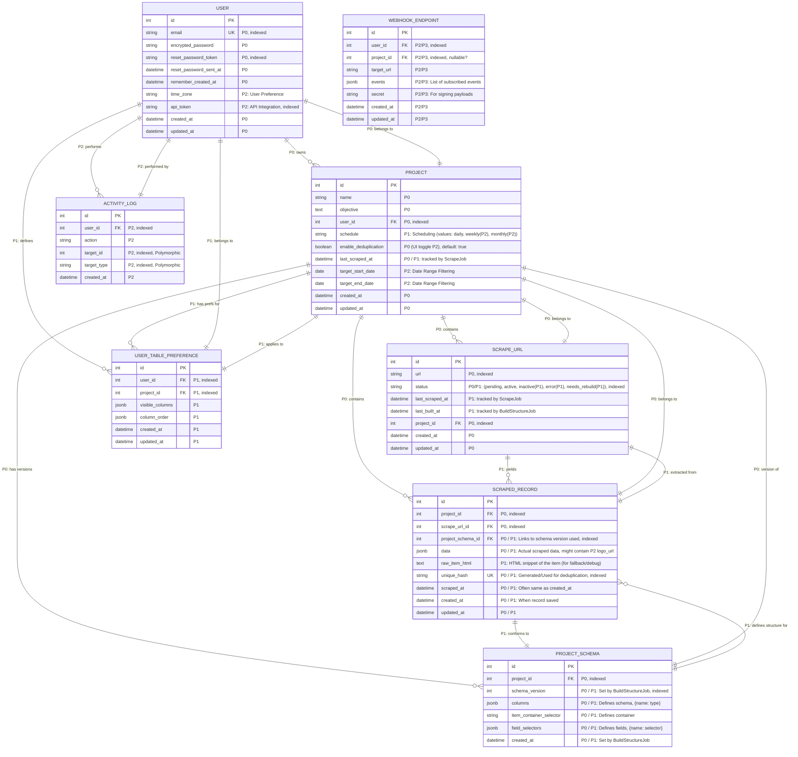

# Entity-Relationship Diagram (ERD)

```mermaid
erDiagram
    %% PHASE 0: Core Models %%
    USER {
        int id PK
        string email UK "P0, indexed"
        string encrypted_password "P0"
        string reset_password_token "P0, indexed"
        datetime reset_password_sent_at "P0"
        datetime remember_created_at "P0"
        string time_zone "P2: User Preference"
        string api_token "P2: API Integration, indexed"
        %% int organization_id FK "P3: Multi-Tenancy"
        datetime created_at "P0"
        datetime updated_at "P0"
    }

    PROJECT {
        int id PK
        string name "P0"
        text objective "P0"
        int user_id FK "P0, indexed"
        %% int organization_id FK "P3: Multi-Tenancy, indexed"
        string schedule "P1: Scheduling (values: daily, weekly(P2), monthly(P2))"
        boolean enable_deduplication "P0 (UI toggle P2), default: true"
        datetime last_scraped_at "P0 / P1: tracked by ScrapeJob"
        date target_start_date "P2: Date Range Filtering"
        date target_end_date "P2: Date Range Filtering"
        %% boolean enable_image_download "P3: Image Storage, default: false"
        datetime created_at "P0"
        datetime updated_at "P0"
    }
    
    SCRAPE_URL {
        int id PK
        string url "P0, indexed"
        string status "P0/P1: (pending, active, inactive(P1), error(P1), needs_rebuild(P1)), indexed"
        datetime last_scraped_at "P1: tracked by ScrapeJob"
        datetime last_built_at "P1: tracked by BuildStructureJob"
        int project_id FK "P0, indexed"
        datetime created_at "P0"
        datetime updated_at "P0"
    }
    
    PROJECT_SCHEMA {
        int id PK
        int project_id FK "P0, indexed"
        int schema_version "P0 / P1: Set by BuildStructureJob, indexed"
        jsonb columns "P0 / P1: Defines schema, {name: type}"
        string item_container_selector "P0 / P1: Defines container"
        jsonb field_selectors "P0 / P1: Defines fields, {name: selector}"
        datetime created_at "P0 / P1: Set by BuildStructureJob"
    }
    
    SCRAPED_RECORD {
        int id PK
        int project_id FK "P0, indexed"
        int scrape_url_id FK "P0, indexed"
        int project_schema_id FK "P0 / P1: Links to schema version used, indexed"
        jsonb data "P0 / P1: Actual scraped data, might contain P2 logo_url"
        text raw_item_html "P1: HTML snippet of the item (for fallback/debug)"
        string unique_hash UK "P0 / P1: Generated/Used for deduplication, indexed"
        %% string status "P3: Optional manual status (e.g., reviewed, exported)"
        %% string tags "P3: Optional tagging (or use gem)"
        datetime scraped_at "P0 / P1: Often same as created_at"
        datetime created_at "P0 / P1: When record saved"
        datetime updated_at "P0 / P1"
    }
    
    %% PHASE 1: Enhancements / UI Features %%
    USER_TABLE_PREFERENCE {
        int id PK
        int user_id FK "P1, indexed"
        int project_id FK "P1, indexed"
        jsonb visible_columns "P1"
        jsonb column_order "P1"
        datetime created_at "P1"
        datetime updated_at "P1"
    }
    
    %% PHASE 2: Advanced Features / Integrations %%
    ACTIVITY_LOG {
        int id PK
        int user_id FK "P2, indexed"
        string action "P2"
        int target_id "P2, indexed, Polymorphic"
        string target_type "P2, indexed, Polymorphic"
        datetime created_at "P2"
    }
    
    WEBHOOK_ENDPOINT {
        int id PK
        int user_id FK "P2/P3, indexed"
        int project_id FK "P2/P3, indexed, nullable?"
        string target_url "P2/P3"
        jsonb events "P2/P3: List of subscribed events"
        string secret "P2/P3: For signing payloads"
        datetime created_at "P2/P3"
        datetime updated_at "P2/P3"
    }
    
    %% PHASE 3: Optional / Future Features (Entities only) %%
    %% ORGANIZATION { %% P3 Feature %%
    %%    int id PK
    %%    string name
    %%    datetime created_at
    %%    datetime updated_at
    %% }
    
    %% USER_MODAL_PREFERENCE { %% P3 Feature %%
    %%    int id PK
    %%    int user_id FK "P3, indexed"
    %%    int project_id FK "P3, indexed"
    %%    jsonb visible_fields
    %%    datetime created_at
    %%    datetime updated_at
    %% }
    
    %% Relationships (Phases Indicate when relation becomes FUNCTIONAL/USED) %%
    USER                ||--o{ PROJECT                  : "P0: owns"
    USER                ||--o{ USER_TABLE_PREFERENCE    : "P1: defines"
    USER                ||--o{ ACTIVITY_LOG             : "P2: performs"
    %% USER             ||--o{ USER_MODAL_PREFERENCE    : "P3: defines"
    %% USER             ||--o{ WEBHOOK_ENDPOINT         : "P2/P3: configures"
    %% ORGANIZATION     ||--o{ USER                     : "P3: has member"
    
    PROJECT             ||--|| USER                     : "P0: belongs to"
    PROJECT             ||--o{ SCRAPE_URL               : "P0: contains"
    PROJECT             ||--o{ PROJECT_SCHEMA           : "P0: has versions"
    PROJECT             ||--o{ SCRAPED_RECORD           : "P0: contains"
    PROJECT             ||--o{ USER_TABLE_PREFERENCE    : "P1: has prefs for"
    %% PROJECT          |o--o| ORGANIZATION             : "P3: belongs to"
    %% PROJECT          ||--o{ USER_MODAL_PREFERENCE    : "P3: has modal prefs for"
    %% PROJECT          ||--o{ WEBHOOK_ENDPOINT         : "P2/P3: can notify via"
    
    SCRAPE_URL          ||--|| PROJECT                  : "P0: belongs to"
    SCRAPE_URL          ||--o{ SCRAPED_RECORD           : "P1: yields"
    
    PROJECT_SCHEMA      ||--|| PROJECT                  : "P0: version of"
    PROJECT_SCHEMA      ||--o{ SCRAPED_RECORD           : "P1: defines structure for"
    
    SCRAPED_RECORD      ||--|| PROJECT                  : "P0: belongs to"
    SCRAPED_RECORD      ||--|| SCRAPE_URL               : "P1: extracted from"
    SCRAPED_RECORD      ||--|| PROJECT_SCHEMA           : "P1: conforms to"
    
    USER_TABLE_PREFERENCE ||--|| USER                   : "P1: belongs to"
    USER_TABLE_PREFERENCE ||--|| PROJECT                : "P1: applies to"
    
    ACTIVITY_LOG        ||--|| USER                     : "P2: performed by"
    %% ACTIVITY_LOG has polymorphic 'target' using target_id/target_type (P2)
    
    %% WEBHOOK_ENDPOINT ||--|| USER                     : "P2/P3: belongs to"
    %% WEBHOOK_ENDPOINT |o--o| PROJECT                  : "P2/P3: targets (optional)"

```