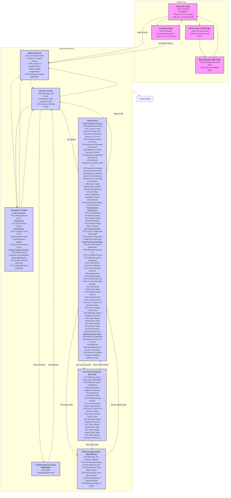

# Sitemap et Section Mermaid MD

```mermaid
flowchart TD
 subgraph subGraph0["Public Area"]
    direction LR
        login["<b>Connexion Page</b><br>- (P0) Formulaire Email/MDP<br>- (P0) Lien vers Inscription<br>- (P0) Lien vers MDP Oublié"]
        signup["<b>Inscription Page</b><br>- (P0) Formulaire Inscription Email/MDP<br>- (P0) Lien vers Connexion"]
        forgotPw["<b>Mot de Passe Oublié Page</b><br>- (P0) Formulaire Email<br>- (P0) Action Envoyer Lien Reset"]
        resetPw["<b>Réinitialisation MDP Page</b><br>- (P0) Formulaire Nouveau MDP<br>- (P0) Action Réinitialiser MDP"]
  end
 subgraph subGraph1["Authenticated Area"]
        dashboard["<b>Tableau de Bord</b><br>- (P1) Vue Globale Stats:<br>  # projets, # scrapers statuts,<br>  # URLs statuts, # enregistrements,<br>  statuts scrapes programmés<br>- (P3) Recherche Globale (potentiel)"]
        projList["<b>Liste des Projets</b><br>- (P0) Affichage Liste Projets<br>- (P0) Bouton Créer Nouveau Projet<br>- (P0) Accès aux Détails Projet"]
        newProj["<b>Création Nouveau Projet Page/Modal</b><br>- (P0) Définir Thème/Objectif Projet"]
        settings@{ label: "<b>Paramètres Compte</b><br><u>Profil &amp; Sécurité:</u><br>- (P1) Changer Mot de Passe<br><u>Préférences:</u><br>- (P2) Choix Fuseau Horaire<br><u>Notifications:</u><br>- (P2) Configurer Notifs Email<br>- (P3) Réception Notifs Email (système)<br><u>Activité:</u><br>- (P2) Journal d'Activité récent<br><u>Gestion Compte (Avancé):</u><br>- (P3) Support Multi-utilisateurs (si applicable)<br><u>API &amp; Intégrations:</u><br>- (P2) Gestion Clés API (potentiel)<br>- (P2) Config Webhooks (potentiel)" }
        projDetail@{ label: "<b>Détail Projet</b><br><u>Config Générale &amp; URLs:</u><br>- (P0) Ajout/Gestion URLs<br>- (P0) Lancer Scrape Manuel ('Scrape Now')<br>- (P0) Action 'Build Data Structure' (LLM Init)<br>- (P0) *Backend:* Analyse LLM URLs<br>- (P0) *Backend:* Nommage Colonnes IA<br>- (P0) *Backend:* Création Structure JSON IA<br>- (P0) *Backend:* Adaptation BD initiale IA<br>- (P0) *Backend:* Déploiement Crawler initial IA<br>- (P0) *Backend:* Scraping Post Initial (HTML brut)<br>- (P0) *Backend:* Détection Boucle Infinie (Alerting)<br>- (P0) *Backend:* LLM Diag. Boucle Infinie<br>- (P0) *Option Projet:* Déduplication ON/OFF<br>- (P1) Activer/Désactiver URL spécifique<br>- (P3) Configuration Manifeste Scraper<br>- (P3) *Backend:* Gestion/Stockage Images (si option activée)<br><u>Programmation (Scheduling):</u><br>- (P1) Programmation Quotidienne (Daily)<br>- (P2) Programmation Hebdo/Mensuelle<br>- (P2) Sélection Plage Dates Scraping<br><u>Suivi Statut Scraping:</u><br>- (P1) Graphe Progression Temps Réel<br>- (P1) Graphe Progression Détaillé (Phases/Logs)<br><u>Table Données Scrappées:</u><br>- (P0) Vue Table Simple (Pagination)<br>- (P0) Affichage Colonnes IA<br>- (P0) Tri Simple Colonne<br>- (P0) Sélection Lignes (Checkbox)<br>- (P0) Action Masse: Supprimer Sélection<br>- (P1) Personnalisation Colonnes (Afficher/Masquer)<br>- (P1) Réorganisation Colonnes (Drag &amp; Drop)<br>- (P1) Lien vers Vue Table Étendue<br> - (P2) Recherche Contextuelle Table<br> - (P2) Filtrage Basique Colonne<br>- (P2) Enrichissement Visuel: Logos Emploi<br>- (P2) Action: Export CSV (données table)<br>- (P3) Filtres Avancés (Type Coda)<br>- (P3) Affichage Images intégrées (si activé)<br>- (P3) Action Masse: Ajouter/Gérer Tags<br>- (P3) Action Masse: Ajouter/Gérer Statut<br>- (P3) Action Masse: 'Change Selected List'<br><u>Backend Associé Table:</u><br>- (P0) *Backend:* Adaptation Dynamique Structure IA (continu)<br>- (P0) *Backend:* Sélection/Déploiement Scraper IA (continu)<br>- (P3) *Backend:* Modèles Scraping Parallèles (analyse comp.)" }
        recDetail["<b>Détail Enregistrement (Modal/Page)</b><br>- (P0) Affichage Tous Champs Collectés<br>- (P0) Vue Données Brutes (HTML/JSON Source)<br>- (P3) Ajout/Gestion Tags (ligne unique)<br>- (P3) Ajout/Gestion Statut (ligne unique)<br>- (P3) Personnalisation Champs Modale<br>- (P3) Affichage Images (si activé)"]
        expandData@{ label: "<b>Vue Données Étendue (DB View)</b><br>- (P1) Affichage Toutes Lignes (sans pagination)<br>- (P0) Sélection Lignes (Checkbox)<br>- (P0) Action Masse: Supprimer Sélection<br>- (P2) Recherche Contextuelle Table<br> - (P2) Filtrage Basique Colonne<br> - (P2) Enrichissement Visuel: Logos Emploi<br> - (P2) Action: Export CSV (données table)<br>- (P3) Filtres Avancés (Type Coda)<br>- (P3) Affichage Images intégrées (si activé)<br>- (P3) Action Masse: Ajouter/Gérer Tags<br>- (P3) Action Masse: Ajouter/Gérer Statut<br>- (P3) Action Masse: 'Change Selected List'" }
  end
    login --> signup & forgotPw
    signup --> login
    forgotPw --> resetPw
    resetPw --> login
    dashboard --> projList & settings
    projList --> dashboard & settings
    settings --> dashboard & projList
    projList -- Voir Détails --> projDetail
    projList -- Créer Nouveau --> newProj
    newProj -- Sauvegarder ----> projList
    projDetail -- Retour Liste --> projList
    projDetail -- Clic Ligne Table --> recDetail
    projDetail -- Voir Tout / DB View --> expandData
    recDetail -- Retour Détail Projet --> projDetail
    expandData -- Retour Détail Projet --> projDetail
    expandData -- Clic Ligne Table --> recDetail
    login -- Login Succès --> dashboard
    signup -- Inscription Succès --> dashboard
    subGraph1 --> n1["Untitled Node"]

    settings@{ shape: rect}
    projDetail@{ shape: rect}
    expandData@{ shape: rect}
     login:::public
     signup:::public
     forgotPw:::public
     resetPw:::public
     dashboard:::auth
     projList:::auth
     newProj:::auth
     settings:::auth
     projDetail:::auth
     recDetail:::auth
     expandData:::auth
    classDef public fill:#f9f,stroke:#333,stroke-width:2px
    classDef auth fill:#ccf,stroke:#333,stroke-width:2px


```