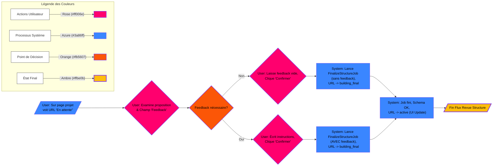
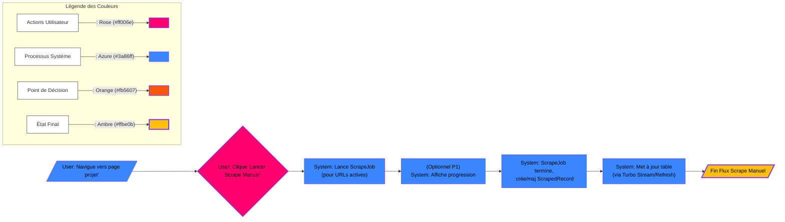
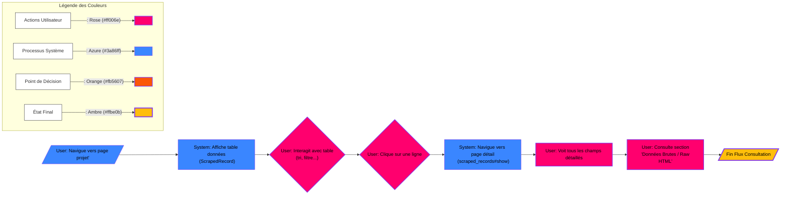
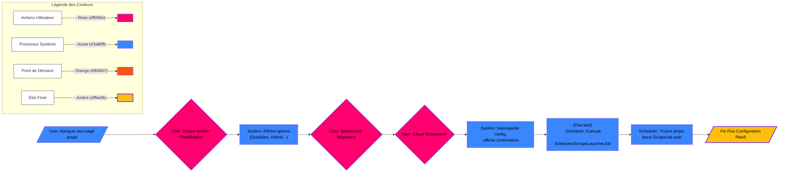

# User flow

Voici les 5 flux utilisateurs (user flows) les plus importants et leurs étapes clés et leur diagrammes Mermaid.

## 1. Flux : Inscription, Création du Premier Projet et Ajout de la Première URL (Onboarding)**

*   **Objectif :** Permettre à un nouvel utilisateur de commencer à utiliser l'application.
*   **Étapes Clés :**
    1.  **Utilisateur :** Arrive sur la page d'accueil (non connecté).
    2.  **Utilisateur :** Clique sur "S'inscrire" / "Sign Up".
    3.  **Système :** Affiche le formulaire d'inscription.
    4.  **Utilisateur :** Remplit Email, Mot de passe, Confirmation -> Clique sur "Créer mon compte".
    5.  **Système :** Crée l'utilisateur, le connecte, le redirige vers le tableau de bord (probablement vide).
    6.  **Système :** Affiche un message/bouton invitant à créer un projet (ex: "Créez votre premier projet").
    7.  **Utilisateur :** Clique sur "Créer un projet".
    8.  **Système :** Affiche le formulaire de création de projet. [Nom du projet] [But du projet]
    9.  **Utilisateur :** Remplit le nom du projet -> Clique sur "Créer".
    10.  **Système :** Crée le projet, redirige vers la page `projects#show` du nouveau projet.
    11.  **Système :** Affiche la section pour ajouter des URLs.
    12.  **Utilisateur :** Entre une URL dans le champ `url`.
    13.  **Utilisateur :** Remplit le champ **`Purpose`** ou But du projet obligatoire (ex: "Extraire titres et entreprises des offres d'emploi").
    14.  **Utilisateur :** Clique sur "Ajouter et Analyser" (ou un bouton similaire).
    15.  **Système :** Sauvegarde la `ScrapeUrl` avec le `purpose`, met le statut à `pending` (ou directement `analyzing`) et lance le `BuildStructureJob` en arrière-plan.

```mermaid
flowchart LR
    %% Définitions des styles avec la nouvelle palette
    classDef userAction fill:#ff006eff,stroke:#8338ecff,stroke-width:2px,color:#000000
    classDef systemProcess fill:#3a86ffff,stroke:#8338ecff,stroke-width:1px,color:#000000
    classDef decisionPoint fill:#fb5607ff,stroke:#8338ecff,stroke-width:2px,color:#000000
    classDef finalState fill:#ffbe0bff,stroke:#8338ecff,stroke-width:3px,color:#000000

    %% --- Début du Flux ---
    A[/"User: Arrive page d'accueil"'/]:::systemProcess --> B{"User: Clique 'S'inscrire'"}:::userAction;
    B --> C["System: Affiche formulaire"]:::systemProcess;
    C --> D{"User: Remplit & Clique 'Créer compte'"}:::userAction;
    D --> E["System: Crée user, connecte,\nredirige Dashboard"]:::systemProcess;
    E --> F["System: Invite créer projet"]:::systemProcess;
    F --> G{"User: Clique 'Créer projet'"}:::userAction;
    G --> H["System: Affiche formulaire projet"]:::systemProcess;
    H --> I{"User: Remplit nom & Clique 'Créer'"}:::userAction;
    I --> J["System: Crée projet,\nredirige vers projet"]:::systemProcess;
    J --> K["System: Affiche section ajout URL"]:::systemProcess;
    K --> L{"User: Entre URL & Purpose"}:::userAction;
    L --> M{"User: Clique 'Ajouter et Analyser'"}:::userAction;
    M --> N["System: Sauve ScrapeUrl,\nlance BuildStructureJob"]:::systemProcess;
    N --> O[/"Fin du flux Onboarding"/]:::finalState;
    
      %% --- Legend ---
    subgraph Légende des Couleurs
        direction LR // Arrange legend items left-to-right

        %% User Action Item
        L_Text_UserAction[Actions Utilisateur]:::legendText -- ": Rose (#ff006e)" --> L_Swatch_UserAction[ ]:::userAction;
        %% System Process Item
        L_Text_SystemProcess[Processus Système]:::legendText -- ": Azure (#3a86ff)" --> L_Swatch_SystemProcess[ ]:::systemProcess;
        %% Decision Point Item
        L_Text_DecisionPoint[Point de Décision]:::legendText -- ": Orange (#fb5607)" --> L_Swatch_DecisionPoint[ ]:::decisionPoint;
        %% Final State Item
        L_Text_FinalState[État Final]:::legendText -- ": Ambre (#ffbe0b)" --> L_Swatch_FinalState[ ]:::finalState;
    end


```
    
    

## 2. Flux : Revue et Finalisation Interactive de la Structure d'une URL

*   **Objectif :** Valider ou corriger la structure de données proposée par l'IA pour une URL spécifique.
*   **Étapes Clés :**
    1.  **Système :** (Après `BuildStructureJob`) Le statut de l'URL passe à `pending_review`. L'UI se met à jour (via Turbo Stream).
    2.  **Utilisateur :** Sur la page `projects#show`, voit la section "Revue de la Structure" apparaître pour l'URL concernée.
    3.  **Utilisateur :** Examine les **colonnes proposées** et les **exemples de données** extraites.
    4.  **SCÉNARIO A : Tout est correct**
        *   **Utilisateur :** Laisse le champ **`User Feedback`** vide.
        *   **Utilisateur :** Clique sur "**Confirmer et Finaliser la Structure**".
    5.  **SCÉNARIO B : Corrections nécessaires**
        *   **Utilisateur :** Écrit ses instructions dans le champ **`User Feedback`** (ex: "Ajouter colonne Salaire", "Nettoyer la colonne Lieu", "Renommer 'col3' en 'Date'").
        *   **Utilisateur :** Clique sur "**Confirmer et Finaliser la Structure**".
    6.  **Système :** Lance `FinalizeStructureJob` (en utilisant le feedback si fourni). Met le statut à `building_final`.
    7.  **Système :** (Après `FinalizeStructureJob`) Sauvegarde le `ProjectSchema` final, met le statut de l'URL à `active`. L'UI se met à jour (via Turbo Stream) et la section de revue disparaît, l'URL apparaît comme prête.

## 3. Flux : Lancement Manuel d'un Scrape pour un Projet

*   **Objectif :** Obtenir les données les plus récentes pour les URLs actives d'un projet.
*   **Étapes Clés :**
    1.  **Utilisateur :** Navigue vers la page `projects#show` d'un projet existant.
    2.  **Utilisateur :** (Vérifie visuellement que les URLs qu'il veut scraper sont bien actives).
    3.  **Utilisateur :** Clique sur le bouton "Lancer un Scrape Manuel" / "Scrape Now" (souvent au niveau du projet).
    4.  **Système :** Lance `ScrapeJob` pour ce projet en arrière-plan.
    5.  **Système :** (Optionnel/P1) Affiche un indicateur de progression (ex: barre de progression, statut "Scraping...").
    6.  **Système :** Pendant le job, filtre les URLs non actives, scrape les autres, crée/met à jour les `ScrapedRecord`.
    7.  **Système :** (Après `ScrapeJob`) Met à jour la table de données sur la page `projects#show` (via Turbo Stream ou refresh). L'indicateur de progression disparaît ou montre "Terminé".

## 4. Flux : Consultation des Données Scrapées et Affichage des Détails

*   **Objectif :** Permettre à l'utilisateur de voir, trier et examiner les données collectées.
*   **Étapes Clés :**
    1.  **Utilisateur :** Navigue vers la page `projects#show`.
    2.  **Utilisateur :** Voit la table des données (`ScrapedRecord`) pour ce projet.
    3.  **Utilisateur :** Interagit avec la table :
        *   Clique sur les en-têtes de colonnes pour trier.
        *   Utilise la pagination pour voir d'autres pages.
        *   (P1/P2) Utilise les filtres ou la recherche contextuelle.
    4.  **Utilisateur :** Clique sur une ligne spécifique de la table qui l'intéresse.
    5.  **Système :** Navigue vers la page de détail de cet enregistrement (`scraped_records#show`).
    6.  **Utilisateur :** Voit tous les champs (`data` JSONB) de l'enregistrement affichés clairement.
    7.  **Utilisateur :** Trouve et consulte la section "Données Brutes" / "Raw HTML" pour voir la source.

## 5. Flux : Configuration d'un Scrape Programmé (Ex: Quotidien)

*   **Objectif :** Automatiser la collecte de données pour un projet.
*   **Étapes Clés :**
    1.  **Utilisateur :** Navigue vers la page `projects#show`.
    2.  **Utilisateur :** Cherche la section "Planification" / "Scheduling" ou clique sur un bouton "Paramètres du projet".
    3.  **Système :** Affiche les options de planification.
    4.  **Utilisateur :** Sélectionne l'option "Quotidien" / "Daily".
    5.  **Utilisateur :** Clique sur "Enregistrer la planification" / "Save Schedule".
    6.  **Système :** Sauvegarde la préférence de planification pour le projet. Affiche une confirmation (ex: "Scrapes quotidiens activés").
    7.  **(Invisible pour l'utilisateur, mais c'est le résultat):** Le `ScheduledScrapeLauncherJob` s'exécutera périodiquement, trouvera ce projet, et lancera le `ScrapeJob` automatiquement.

Ces 5 flux couvrent les interactions principales et critiques de l'application, de l'entrée de l'utilisateur à la consultation des résultats, en passant par la configuration essentielle du scraping, y compris le nouveau processus de revue interactive.